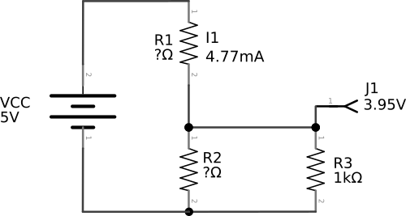
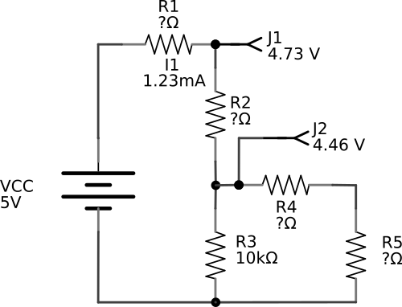
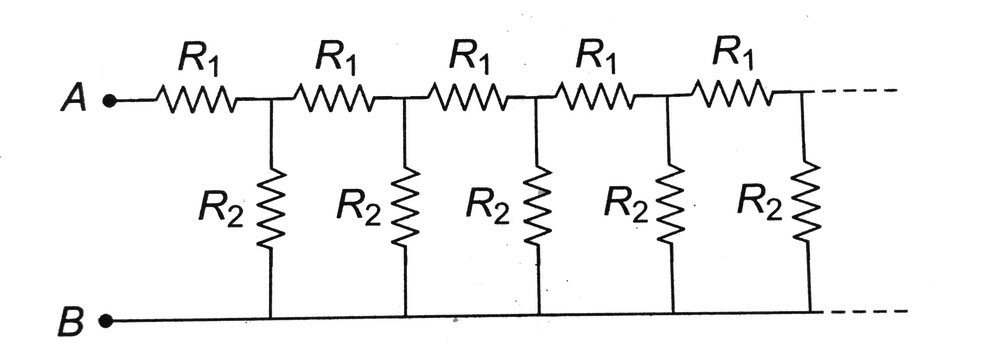

# 0x00 - Circuits

## Solution:

- [Calculations](solution/calculations.pdf)
- [Diagram](solution/values.png)

## Objective:

In working with electronics, being able to deduce voltage changes throughout a circuit is an essential skill. Apply your knowledge on the relation between voltage, current, and resistance to determine missing resistance values.

## Steps:

### 1. Calculate the Value of the missing Resistors of Circuit 1:

Taking into account the relation between voltage, current, and resistance, solve for the missing resistor values in the following circuit:

Given: 
**VCC = 5V** 
**I1 = 4.77mA** 
**J1 = 3.95V** 
**R3 = 1K&Omega;** 

Solve for: 
**R1** = _____________  
**R2** = _____________  

### 2. Calculate the Value of the missing Resistors of Circuit 2:

Solve for the missing resistor values in the following circuit:

Given: 
**VCC = 5V** 
**I1 = 1.23mA** 
**J1 = 4.73V** 
**J2 = 4.46V** 
**R3 = 10K&Omega;** 

Solve for: 
**R1** = _____________  
**R2** = _____________  
**R3** = _____________  
**R4** = _____________  

## `H@k3rm@n` Challenge:

**WARNING:** :warning: These problems are at the `H@k3rm@n` level. They are not required. :warning:

### 1. The Infinite Resistor Chain:

Assuming all resistor values are 1&Omega;, find the equivalent resistance of the following chain of infinite resistors:

- [Solution](solution/infinite_resistor_chain.pdf)

### 2. Superposition:

Solve for **Vr2** in the following circuit:

- [Solution](solution/superposition.pdf)
