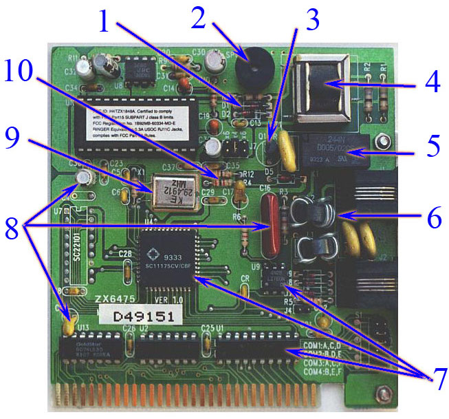
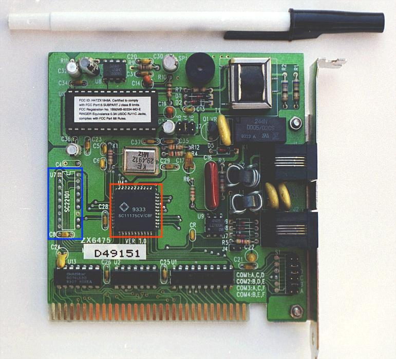

# 0x01 - Find the Component

## Solution:

- [Solution](solution/solution.md)

## Objective:

Identifying components on a PCB is a critical hardware reverse engineering skill to target components with information (like firmware) and any related components. Joe from your office gave you the following PCB and asked you to perform some initial identification of components.

## Steps:

### 1. Apply your knowledge about electrical components and identify family of the following components:

**1** = _____________  
**2** = _____________  
**3** = _____________  
**4** = _____________  
**5** = _____________  
**6** = _____________  
**7** = _____________  
**8** = _____________  
**9** = _____________  
**10** = _____________  

## `H@k3rm@n` Challenge:

**WARNING:** :warning: These problems are at the `H@k3rm@n` level. They are not required. :warning:

For the following questions, refer to the following diagram:

### 1. New chip, Who dis?

Find the manufacturer of the chip in the red box.

### 2. Dude, where's my chip?

Find the datasheet for the missing chip in the blue box.

[H@k3rm@n Solutions](solution/hackerman.md)
