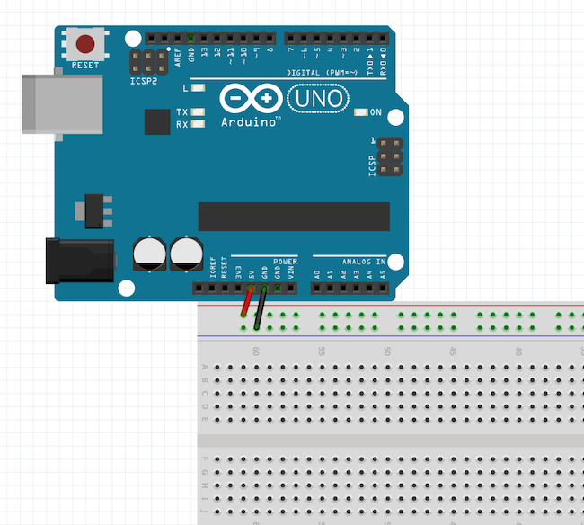
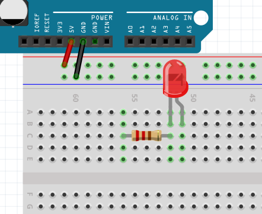
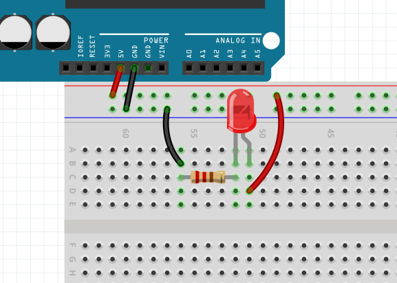
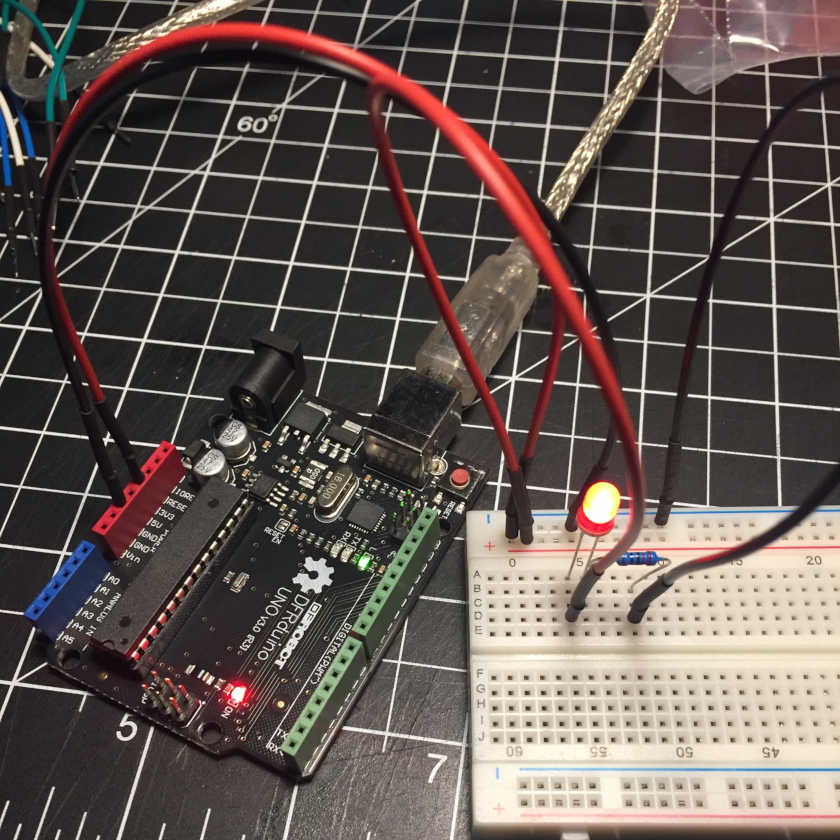

# 0x02 - Light an LED

## Solution:

- [Diagram](solution/01-Light_an_led_schem.svg)

## Resources:

- Arduino [datasheet-ATMega328P](resources/ATmega328P.pdf)
- DFR LEDs [datasheet](resources/5mm-led.pdf)

## Objective

Build the following Schematic:

## Steps

### 1. Calculate the Value of the Current Limiting Resistor (R1):

Before the circuit can be assembled, it must be fully defined. Taking into account a general assumption about current and voltage across this LED (20mA @ 2V), the only unknown is the value of the current limiting **resistor** which can be found by using the formula:

**V = I \* R**

Rearranging the equation we can solve for the value of **R1** by dividing the needed voltage drop  across the resistor by the circuit's current:

**VR1 = I \* R1** becomes **R1= VR1 / I**

To find **VR1**, we use the fact that a series circuit's total voltage drop is equal to the sum of the voltage drops of it's components:

**VCC = &Sigma; Vn** or in our circuit **VCC = VD1 + VR1** which can be rearranged to **VR1 =  VCC - VD1**

The equation to solve for the resistor value is:

**R1 = (VCC - VD1) / I**

Fill in the known values of **VCC** (5V), **VD1** (2V), and **I** (20mA) and calculate the value of **R1**
 
(*hint: check the datasheets*)

**R1** = _____________

### 2. Assemble the Circuit:

Start by wiring your breadboard with **VCC** (5V) and **Ground**:

Add the resistor **(of your calculated value or higher)** to the circuit along with your LED:

**NOTE:** Be mindful of the polarity of the LED!

Finally, add the remaining wires to connecting the LED's cathode to **VCC** and the resistor to **Ground**:

Perform any last minute continuity tests now to verify your work.

### 3. Powering it Up:

Connect the Arduino to power (your laptop) with the USB Type-A to Type-B cable. You should now be basking in the dim red glow of your completed circuit:

## `H@k3rm@n` Challenge:

**WARNING:** :warning: These problems are at the `H@k3rm@n` level. They are not required. :warning:

### 1. MORE LIGHT:

Use your multimeter to measure the current coming from the Arduino for your single (puny) LED. Is it approximately 20mA as we assumed? Using this info and what you know about series & parallel circuits, **calculate** how many LEDs you can actually light up using **only** the Arduino's 5V pin supply when the Arduino is powered off USB alone. Draw the schematic for this new circuit.

  - **NOTE:** "light up" in this case means that the diode's light would be visible to the naked eye in a completely dark room ;)
  - [Solution](solution/more_light.md)
