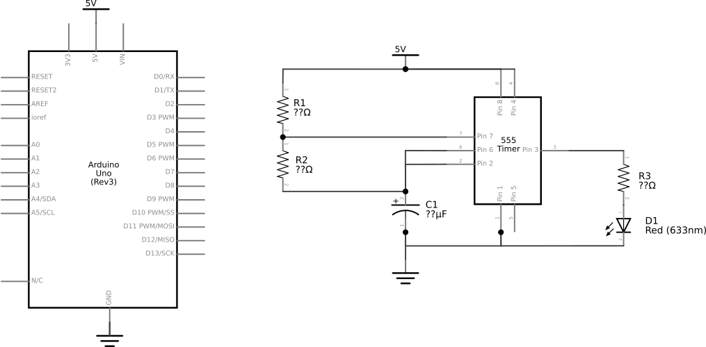
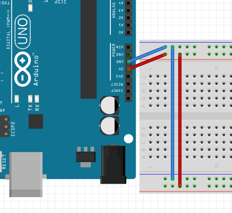
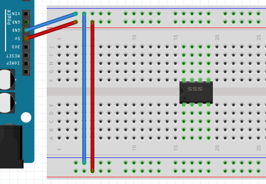
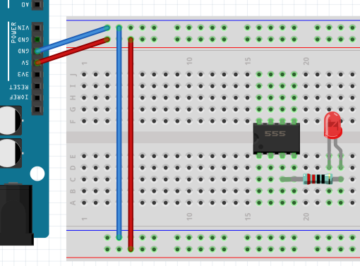
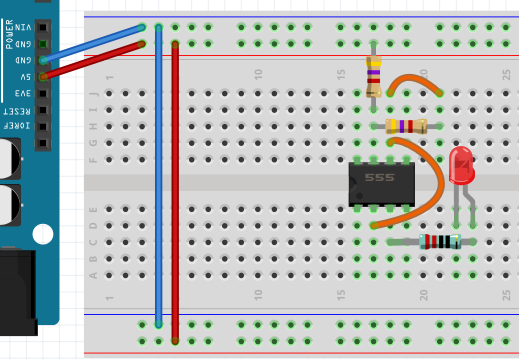
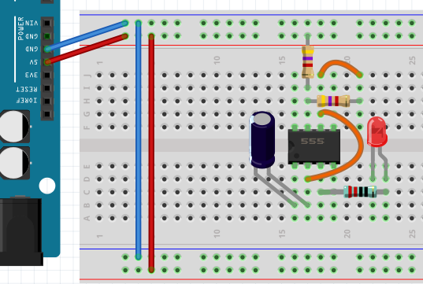
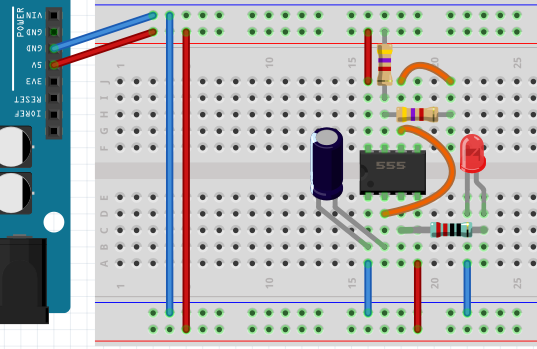
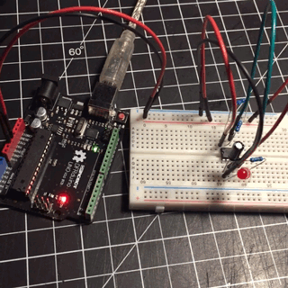

# 0x03 - Reading a Datasheet

## Solution:

Solution is shown by completing the lab steps.

## Resources:

- 555 Timer IC Dip-8 [datasheet](resources/na555.pdf)
- Capacitor (correct value should be in your kit)

## Objective

Fully define and build the following schematic of using the **A-STABLE** mode of a 555 Timer IC to blink an LED:

## Steps

### 1. Calculate the Value of the Current Limiting Resistor (R3):

In order to observe the function of the 555 Timer circuit, we will be adding an LED to output signal to give a visible representation of what is going on. Referring to the data sheet, identify the function and determine the voltage of pin 3:

**pin3** = ___________________

**Vpin3** = ___________________

Using what you learned in Lab 01, calculate the value of **R3** needed to limit the current to the LED (**D1**):

**R3** = ___________________

### 2. Define the Value of R1 and R2 Based on C1:

Refer to the section of the datasheet on "A-stable Operation" and choose a set of resistor values for **R1 and R2** that will compliment the value of your capacitor **C1**:

The goal is to have the output frequency low enough to be seen. Anything below 30 Hz should work.

**Calculated Frequency** &ap; __________________ Hz

### 3. Assemble the Circuit:

Start By wiring your breadboard with **VCC** (5V) and **Ground**:

**NOTE:** I have added jumpers to the bottom rails to simplify the construction of the circuit

Place the 555 dip-8 IC middle of the breadboard so that pin one is in the lower half of the breadboard and pin 8 is in the top spanning the middle isolation gap:

Wire up the led (**D1**) and your chosen resistor (**R3**) in series at **Pin 3**:

Wire your chosen resistors for **R1** between **Vcc** and **Pin 7.** Wire **R2** between **Pin 7** and **Pin 6.** Place a jumper wire from **Pin 6** and **Pin 2**:

Add your capacitor (**C1**) with the positive side on the output of **Pin 2** and the negative side on **Pin 1**:

Finally, connect **Vcc** to **Pin 8** and **Ground** to **Pin 1** and the Cathode of the LED (**D1**):

**Perform any last minute continuity tests now to verify your work!**

### 4. Powering it Up:

Connect the Arduino to power (your laptop) with the USB Type-A to Type-B cable. If everything is wired correctly,  and you chose chose your resistors to tune your circuit to a visible frequency, you should see your (**D1**) blinking away:

## `H@k3rm@n` Challenge:

**WARNING:** These problems are at the `H@k3rm@n` level. They are not required.

### 1. Knock Knock

Convert your design into a **variable-tone** door bell using a piezo buzzer and a push button switch.

- [Solution](solution/hackerman.md)
