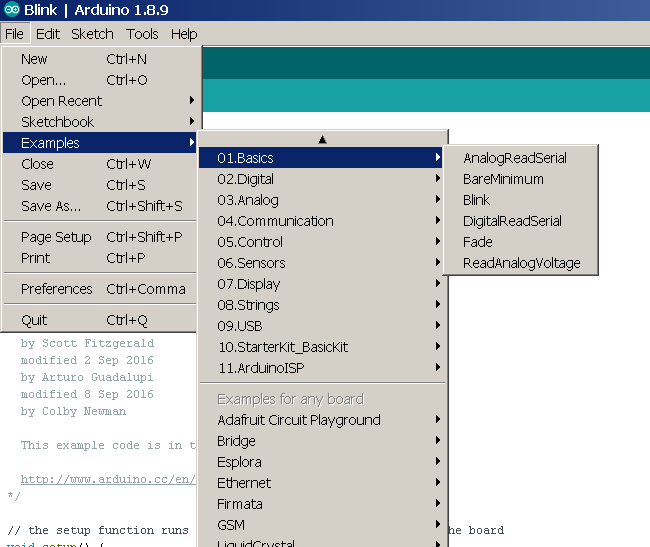
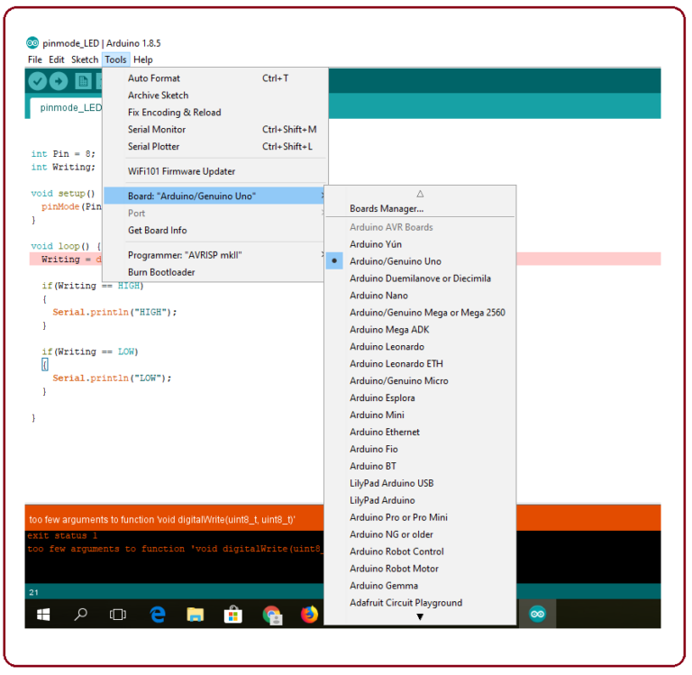
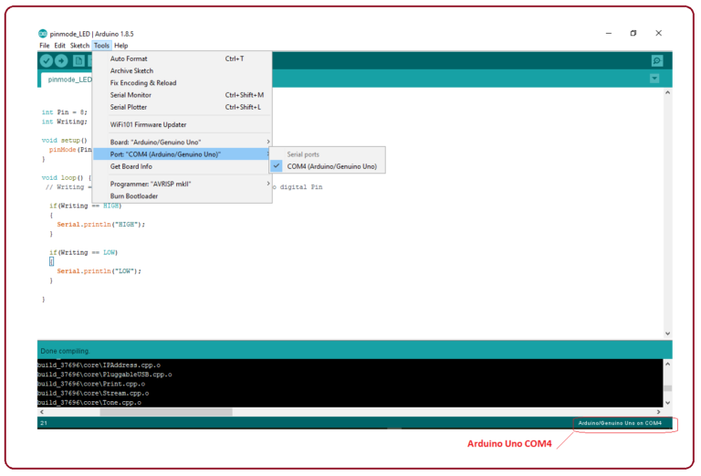

# 0x10 - Blink an LED

## Solution:

Solution is shown by completing the lab steps.

## Resources:

- Follow the [setup instructions](../../syllabus.md#setup) from the syllabus if not done already

## Objective

Demonstrate a functioning Arduino and understanding of how to use the Arduino IDE by blinking an LED.

## Steps

### 1. Assemble the circuit:

The circuit should be setup as follows:

**NOTE:** Be mindful of the polarity of the LED!

### 2. Open the Blink project in the Arduino IDE:

Arduino comes with many prebuilt code examples. We are going to use the premade `Blink` program. Open it as follows:

### 3. Configure the Arduino IDE to program your Arduino:

Connect the Arduino to through USB. Select the correct board type (Arduino UNO) and the appropriate COM port on your computer:

### 4. Compile and upload the Blink program to your Arduino:

Press the **Upload** to upload the code to the board (you can also press the **Verify** button first to check for compiler errors, but this will be done when you select **Upload** as well). After the program is compiled and written to the board (watch the **TX/RX** lights on the board) you should now have a blinking LED!

**NOTE:** `LED_BUILTIN` (which is Pin 13 for the UNO) also has an onboard LED linked to it, which can be helpful for debugging more complicated input/output.

## `H@k3rm@n` Challenge:

**WARNING:** These problems are at the `H@k3rm@n` level. They are not required.

### 1. CLI || GTFO

Without using the Arduino IDE, write the `Blink` program in C. Then compile & upload it to the Arduino from the command line.

- [Solution](solution/hackerman.md)
