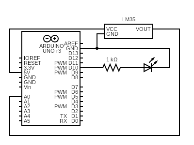
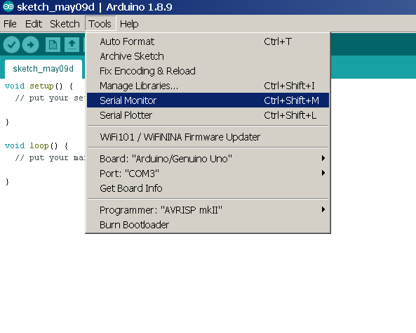

# 0x11 - Variable Fade LED

## Solution:

- [Solution](solution/solution.md)

## Resources:

- Follow the [setup instructions](../../syllabus.md#setup) from the syllabus if not done already
- [LM35 Datasheet](resources/lm35_datasheet.pdf)

## Objective

Use analog input to control an LED's brightness via PWM with serial output for debugging.

## Steps

### 1. Assemble the circuit:

We will use a temperature sensor IC, the LM35, which outputs variable voltage depending on temperature, to fade an LED proportionally. The circuit should be setup as follows:

**NOTE:** If your kit does not have an LM35 (others may have broken it for you...), try using some of the other sensors to achieve the same result (like the ambient light sensor).

Pin A0 is our analog input from the sensor and pin 10 is the digital pin that we will use to drive the LED.

**!!! NOTE: !!!** Be very careful about which way you orient the LM35! The datasheet can be deceiving (bottom-view means looking up from the board)

### 2. Write code to read analog input from the LM35 and print it via serial:

Analog input must come in on one of the analog pins (A0-A5) and is read with `analogRead(pin)`.

**HINT:** The *Analog->Fading* example may prove helpful here.

Serial I/O can be used to take input from or provide output to the computer. Use [Arduino's Serial library](https://www.arduino.cc/reference/en/language/functions/communication/serial/) to print the values you are getting from `analogRead()` and verify your circuit.

Serial communication with the Arduino can be controlled within the Arduino IDE with *Serial Monitor*:

Make sure to use `Serial.begin(baudRate)` in your `setup()` and the baud rate set in *Serial Monitor* should match (9600 is a pretty standard value). If you are getting no output on the Serial Monitor then you probably did not setup or call the Serial code correctly. If you are getting output values but they are 0 or are otherwise unchanging when you warm the LM35. Otherwise, your LM35 circuit may be incorrect.

### 3. Write the code to use the analog input from the LM35 to set the output for the LED:

Analog outputs must be provided via Pulse-Width Modulation (PWM), because processors based on digital logic only know HIGH and LOW. PWM is a way of simulating analog voltage values between HIGH and LOW by providing a fast square wave that is only on for portions of the period (the duty cycle). The digital pins on the Arduino that can be used for PWM are marked with a **~**; they are pins 3, 5, 6, 9, 10, and 11. You will need to range and scale the analog output of the temperature sensor properly based on the LM35 datasheet before deciding what range of values to pass to your LED.

### 4. Compile, upload, and test your variable fade program:

You should be able to fade the LED by warming the temperature sensor with your fingers and then letting it cool.

## `H@k3rm@n` Challenge:

**WARNING:** These problems are at the `H@k3rm@n` level. They are not required.

### 1. Why so serial?

Without using the Arduino IDE, write a serial echo application in C for the Arduino (Atmega328p). Then compile & upload it to the Arduino from the command line. This application should **not** use any Arduino libraries but still work with the IDE's *Serial Monitor* for testing. Write your solution using polling **and** interrupt driven IO.

**HINT:** Go back and do lab 0x10's `H@k3rm@n` challenge if you are lost here ;)

- [Solution](solution/hackerman.md)
