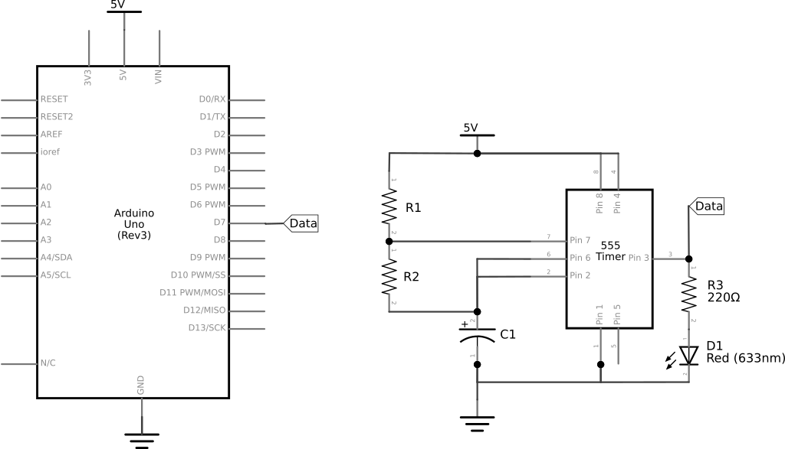
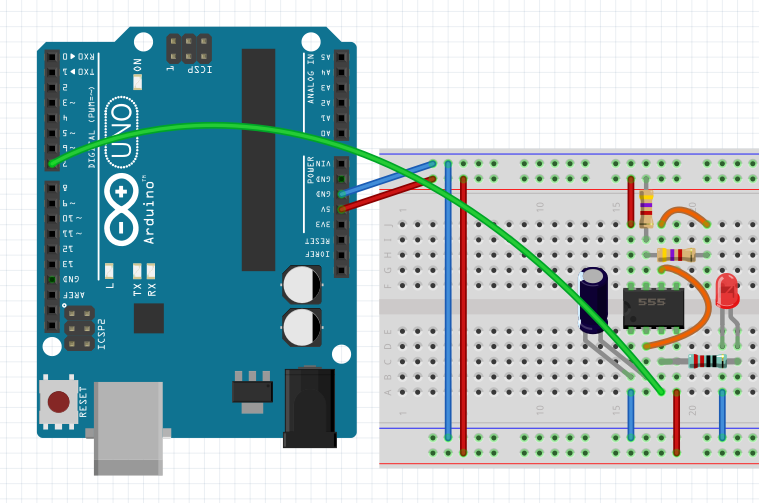
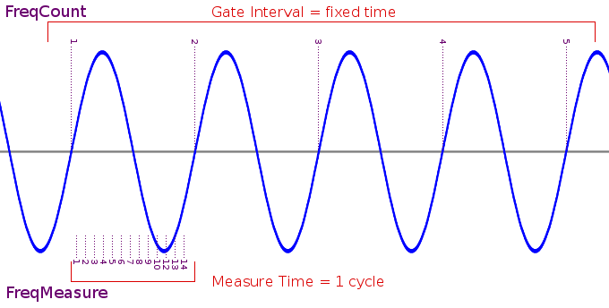

# 0x12 - Frequency Detection

## Solution:

- [Solution](solution/solution.md)

## Resources:

- Follow the [setup instructions](../../syllabus.md#setup) from the syllabus if not done already

## Objective

Use digital input to detect the frequency of a 555 Timer circuit and output that value to a serial monitor.

## Steps

### 1. Assemble the circuit:

The circuit should be setup as follows:

Use/reassemble the 555 timer circuit you created for lab 0x03 and add a jumper from the output of the 555 timer circuit to digital **Pin 7** of the Arduino:

### 2. Write code to read digital input from the timer circuit and determine the frequency:

Using what you have learned from other labs, write a sketch that will analyze the signal received on **Pin 7**, determine the frequency of that signal and output the frequency value to the serial monitor.

**Useful Links:**

- [`double`](https://www.arduino.cc/reference/en/language/variables/data-types/double/)
- [`digitalRead(pin)`](https://www.arduino.cc/reference/en/language/functions/digital-io/digitalread/)
- [`time = micros()`](https://www.arduino.cc/reference/en/language/functions/time/micros/)
- [`Serial.print(...)`](https://www.arduino.cc/en/Serial/Print)

When determining the frequency of a signal, there are two general approaches: **Frequency Counting** and **Frequency Measuring**

- **Frequency Counting**: counts the number of cycles that occur during a fixed time. This works well for relatively high frequencies (1 kHz to 8 MHz), because many cycles are likely to be counted during gate interval. At lower frequencies, very few cycles are counted, giving limited resolution.

- **Frequency Measuring**: measures the elapsed time during a single cycle. This works well for relatively low frequencies (0.1 Hz to 1 kHz ), because a substantial time elapses. At higher frequencies, the short time can only be measured at the processor's clock speed, which results in limited resolution.

Remember, to convert from seconds (***t***) to frequency in Hertz (***f***), use the formula: ***f = 1/t***

### 3. Compile, upload, and test your frequency detector:

You should see the detected frequency values displayed on the serial monitor. Compare these values against the value you calculated for your 555 timer in lab 0x03.

## `H@k3rm@n` Challenge:

**WARNING:** These problems are at the `H@k3rm@n` level. They are not required.

### 1. If some data is good, more MUST be better ...

Darn. Your boss wasn't very impressed with your frequency counter. Sure, you can identify the primary frequency, but what about harmonics? Your 555 timer doesn't generate a perfect sine wave. Instead, it generates a square wave, which can be approximated by an [infinite sum of sine waves](https://mathworld.wolfram.com/FourierSeriesSquareWave.html). Your boss wants to measure those frequencies too!

It's time to move out of the time domain (essentially measuring the time between events) and into the frequency domain (measuring the frequency of events). It's time for ***Fourier Analysis***!

Sample the incoming frequency, FFT it and then output the data to be plotted. 

**REFERENCE:** [Fast Fourier Transform Wiki](https://en.wikipedia.org/wiki/Fast_Fourier_transform)

**HINT:** It is helpful to use a 10K&Omega; potentiometer (pot), with smaller resistors in parallel with the side corresponding to ***RA*** from the 555 timer datasheet. The smaller resistors will set your max frequency while the size of the pot will set your minimum frequency. You can then adjust the pot to see the impact on the spectrum in real time.

**HINT:** Don't write your own FFT function (unless you're the type of person who also rolls their own crypto). Use a [library](https://www.arduino.cc/reference/en/libraries/arduinofft/). For convenience, this library is in the resources folder of this lab.

**HINT:** A Python script using matplotlib is a really easy (albeit slow) way to plot serial data.

[`H@k3rm@n` Solution](solution/hackerman.md)
