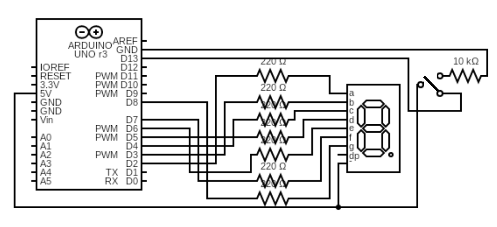
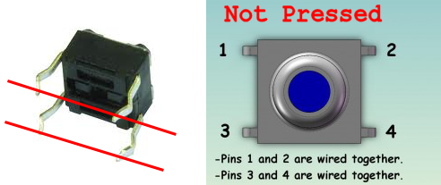
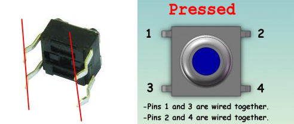
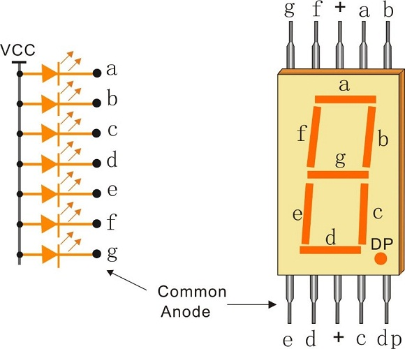

# 0x13 - Digital Counter

## Solution:

- [Solution](solution/solution.md)

## Resources:

- Follow the [setup instructions](../../syllabus.md#setup) from the syllabus if not done already

## Objective

Demonstrate how to use conditionals with digital input and control a multi-LED display.

## Steps:

### 1. Assemble the circuit:

The circuit should be setup as follows (it's easiest when a-g on the display map to sequential digital output pins on the controller):

**NOTE:** If you are having problems with "noise" when reading the state of push-button, consider the Voltage of pin D13 (the push-button pin) when being pressed and not being pressed (use your multimeter if you are unsure!).

The following diagrams illustrate how the push button functions as a switch:

If the button pin 1 is connected to VCC, pin 3 is your output pin and pin 4 should have a pull down resistor to GND. When the button is not pressed, pin 3 is pulled down to zero (LOW) through pin 4. When it is pressed, pin 3 will be disconnected from pin 4 and connected to pin 1, pulling it to HIGH.

The pinout for the LED display is as follows:

**NOTE:** The 8-segment display that we are using has a common anode! This means that it needs to be connected to VCC (the `+` pin) and the individual LED pins (a-g) should be brought <u>**HIGH** to turn the LEDs off</u> and <u>**LOW** to turn them on</u>.

### 2. Write the code to read the button input, update a counter, and feed the LED display:

The push buttons that come in the Arduino kit are already debounced, but you need to track internal state of the button to determine when it has changed state and update the counter accordingly. Look at *Digital->StateChangeDetection* if this is confusing.

Multi-LED displays are often set with a shift register, but we can easily set them directly with the microcontroller by setting each LED pin according to an internal number array as follows:

| Digit | (abcdefg) | a | b | c | d | e | f | g |
|:---:|:---:|:---:|:---:|:---:|:---:|:---:|:---:|:---:|
| 0 | `0×7E` | on | on | on | on | on | on | off |
| 1 | `0×30` | off | on | on | off | off | off | off |
| 2 | `0×6D` | on | on | off | on | on | off | on |
| 3 | `0×79` | on | on | on | on | off | off | on |
| 4 | `0×33` | off | on | on | off | off | on | on |
| 5 | `0×5B` | on | off | on | on | off | on | on |
| 6 | `0×5F` | on | off | on | on | on | on | on |
| 7 | `0×70` | on | on | on | off | off | off | off |
| 8 | `0×7F` | on | on | on | on | on | on | on |
| 9 | `0×7B` | on | on | on | on | off | on | on |
| A | `0×77` | on | on | on | off | on | on | on |
| B | `0×1F` | off | off | on | on | on | on | on |
| C | `0×4E` | on | off | off | on | on | on | off |
| D | `0×3D` | off | on | on | on | on | off | on |
| E | `0×4F` | on | off | off | on | on | on | on |
| F | `0×47` | on | off | off | off | on | on | on |

### 3. Compile, upload, and test:

Pressing the button should increment the 8-segment display from 0-9 (or F) and back to 0.

## `H@k3rm@n` Challenge:

**WARNING:** These problems are at the `H@k3rm@n` level. They are not required.

### 1. _"wanna play a little game?"_

Convert this basic counter into a guessing game where, while the button is held down, the counter increments (with rollover) at a given pace. If the user lets go of the button on the number 7, the player advances to the next level where the increment pace decreases (counting is more rapid) by some set amount and the user tries again. If the user lands on any other number besides 7, the LEDs flash and the game resets due to a game over. Also, do this without the Arduino IDE or any Arduino libraries (duh).

**NOTE:** Let the instructors play your game in order to get credit :)

- [Solution](solution/hackerman.md)
