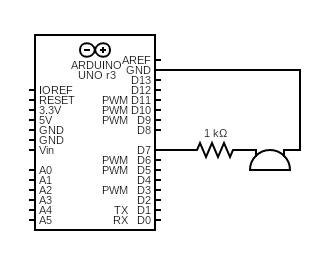
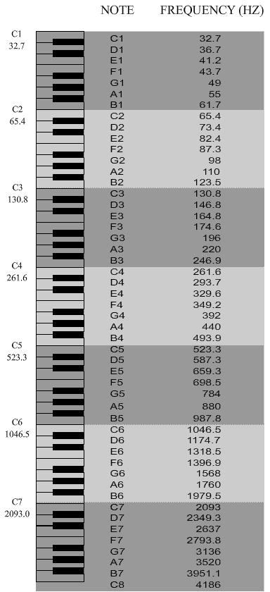

# 0x14 - Music

## Solution:

- [Solution](solution/solution.md)

## Resources:

- Follow the [setup instructions](../../syllabus.md#setup) from the syllabus if not done already
- [Arduino `Tone()` Library](https://www.arduino.cc/reference/en/language/functions/advanced-io/tone/)

## Objective

Demonstrate how PWM signals can be used to create tones and learn about piezo devices.

## Steps:

### 1. Assemble the circuit:

A piezoelectric buzzer is made of a specific material that changes shape when current is passed through it (and actually creates an electric field when it is physically distorted, so it can also be used as a vibration/noise detector). Piezoelectric materials have a tremendous number of applications and are used in acoustics, clocks, (i.e. crystal oscillators), car engines (sensors and fuel injection), medical equipment (CTs, MRIs, microscopes, ultrasounds, etc.), and much more. We will use one to play our favorite tunes. The circuit should be setup as follows:

**NOTE:** The resistor is optional (the piezo buzzer has its own internal resistance), but your lab neighbor may appreciate your concern for their ears (resistor value can be modified to increase or decrease volume, which modifies the PWM signal's amplitude). Serial is helpful for debugging if you are having any issues.

### 2. Write the code to play tones via a PWM signal:

The code you will need is mostly complete in *Digital->toneMelody* (but feel free to write your own). The *tone()* and *noTone* functions are all that you need. You can use Arduino's built-ins or input the frequencies yourself. Here is a chart the maps frequencies to musical notes:

### 3. Compile, upload, and run:

Use the above chart to play some tones and make a song!

## `H@k3rm@n` Challenge:

**WARNING:** These problems are at the `H@k3rm@n` level. They are not required.

### 1. `<fill this in>`.mp3

This challenge is open-ended. Turn your Arduino into a music box by using the Arduino Tone library to play a dope tune (Yes, you can use the Arduino IDE just this once...). Here are some examples for inspiration:

- https://github.com/robsoncouto/arduino-songs

Bragging rights go to the best tune. Don't be boring by just playing something you found online. This is a `H@k3rm@n` challenge after all...

**NOTE:** There is no solution here (be creative!)
