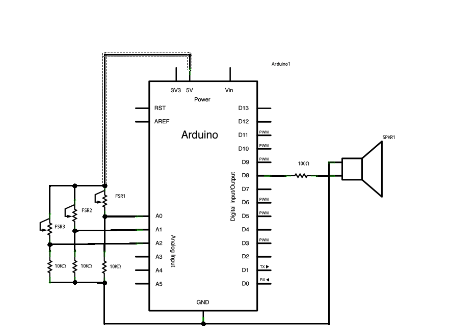

# 0x15 - Basic Piano

## Solution:

**NOTE:** There is no single solution to this lab. It depends on your implementation.

## Resources:

- Follow the [setup instructions](../../syllabus.md#setup) from the syllabus if not done already
- [Reference Implementation](https://www.arduino.cc/en/Tutorial/toneKeyboard)

## Objective

Use digital or serial input with the piezo buzzer to create a simple piano.

## Steps:

### 1. Assemble the circuit:

You may use serial input from your computer or direct digital input from all of your push buttons to create a basic piano that can play multiple tones. This is one of those tasks where there are many decisions that can be made about what to do in hardware and what to do in firmware.

You can hook the push buttons directly to the analog output as shown below:

Alternatively, you can hook the push buttons to digital input and only use one analog output to the buzzer, controlled by additional logic. If you and your neighbor(s) are done with the previous lab, you may also combine your kits to use multiple buzzers if you want to be able to play chords.

Finally, if you want to use the hardware/drivers included in the expensive piece of hardware that is your laptop, you can take serial input and use that to decide what tone to play (you will have to decide what your key mapping/format will be).

### 2. Write your code:

Your code will depend on what route you take for providing input to the buzzer.  The instructors and TAs are willing to help with any bugs you encounter.

### 3. Compile, upload, and play any tune:

You now have a basic piano with which to entertain your friends!

## `H@k3rm@n` Challenge:

**WARNING:** These problems are at the `H@k3rm@n` level. They are not required.

### 1. Now this is a banger:

The Arduino Tone library has some limitations:

- https://github.com/bhagman/Tone#ugly-details

Since the ATmega328 only has 3 hardware timers, only 3 tones can be played at once right? L0Lz, as a `H@k3rm@n`, you know that is false. Write a bit-bang approach to the Tone library that can play an audible tone without any Arduino libraries or the IDE.

- [Solution](solution/hackerman.md)
