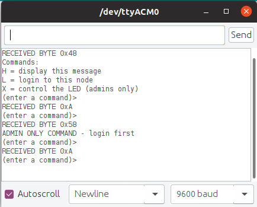

# 0x16 - Internal EEPROM

## Solution:

- [Solution](solution/solution.md)

## Resources:

- Follow the [setup instructions](../../syllabus.md#setup) from the syllabus if not done already
- [Arduino `EEPROM` Library Reference](https://www.arduino.cc/en/Reference/EEPROM)

## Objective

Learn how to read/write the internal EEPROM on the Arduino.

## Steps:

### 1. Write the code to read from the ATmega328's internal EEPROM:

Use the *EEPROM.read(address)* function to **read** the 1KB EEPROM on the ATmega328 and output it the contents via serial.

### 2. Use a serial communication program to write EEPROM contents to a file:

Use a serial communication program to write the output you received from reading the EEPROM to a binary file for analysis. There are many programs that can do this. Here are some options:

- [`putty`](https://www.chiark.greenend.org.uk/~sgtatham/putty/)
- [`stty`](https://www.man7.org/linux/man-pages/man1/stty.1.html)
- [`pyserial`](https://pythonhosted.org/pyserial/)

### 3. Examine the output binary data to see if there is anything interesting there:

Use your favorite binary analysis tool for this job. Here is one to check out if you are not familiar with any:

- [`binwalk`](https://github.com/ReFirmLabs/binwalk/wiki/Usage)

**HINT** You can ouput found files using: 
```
binwalk -D='.*' file.bin
``` 

### 4. Did you find the flag?

If so, great job!

## `H@k3rm@n` Challenge:

**WARNING:** These problems are at the `H@k3rm@n` level. They are not required.

### 1. beep ... beep

Instead of dumping the EEPROM data over serial, use the on-board LED and "exfil" the EEPROM flag contents using Morse Code. Also, do this without any Arduino libraries or the IDE.

- [Solution](solution/hackerman1.md)

### 2. Buffer Overflow an Arduino

You have been tasked with exploiting a vulnerable Arduino IoT device with a command interface exposed over UART. A compiled ELF binary of the target application running on the device can be downloaded [here](resources/hackerman.bin). Program your Arduino with this binary as follows:

**NOTE:** `/dev/ttyACM0` is the serial port _your_ Arduino is on in the Ubuntu VM

```bash
# extract the raw instructions from the ELF binary
avr-objcopy -O ihex -R .eeprom hackerman.bin hackerman.hex
# upload the raw instructions to the Arduino
avrdude -F -V -c arduino -p ATMEGA328p -P /dev/ttyACM0 -b 115200 -U flash:w:hackerman.hex
```

Open the Arduino IDE's Serial Monitor to interact with the target application at 9600 baud (8-N-1) to send commands. **Your job is to bypass the login prompt to get admin access on the device**. Write a script that will automate this attack without using the Arduino IDE's Serial Monitor app:



**HINT:** You may want to bust out your favorite debugger to help out...

- [Solution](solution/hackerman2.md)
