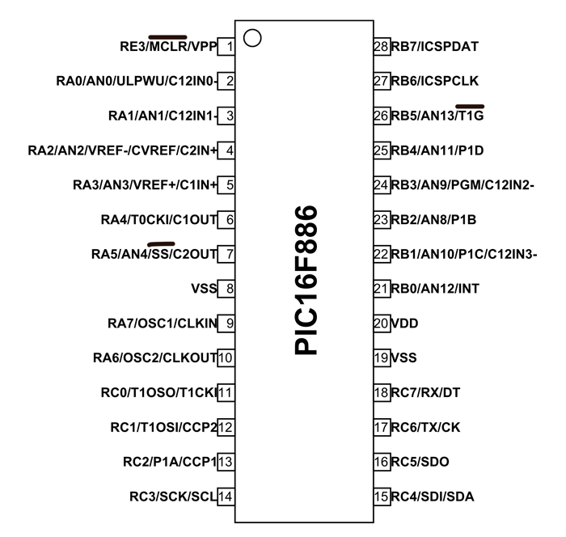
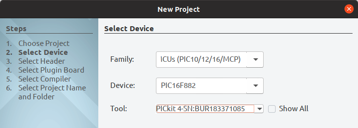
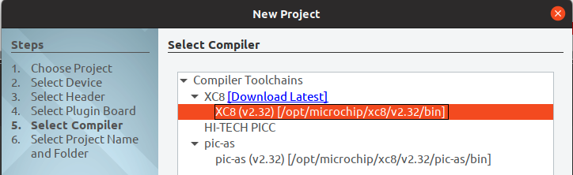
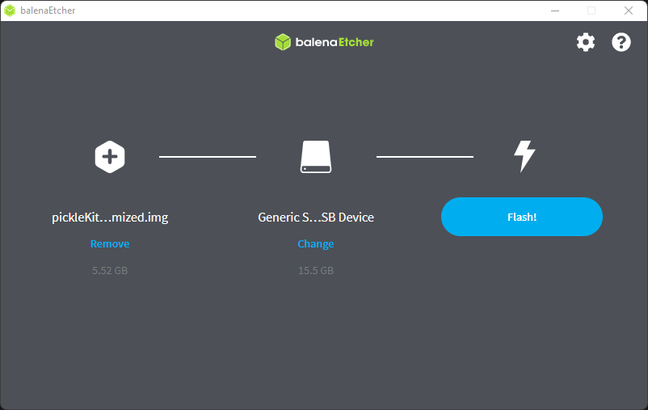
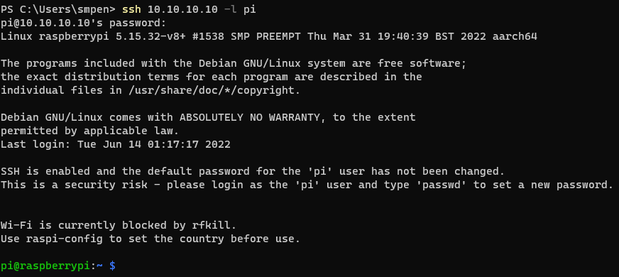
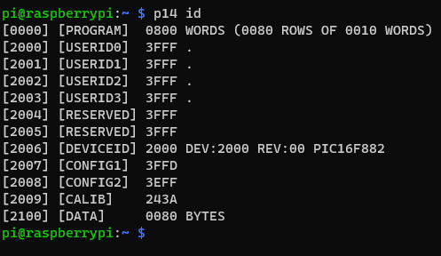
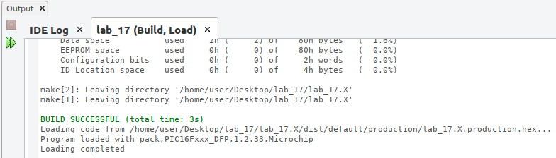
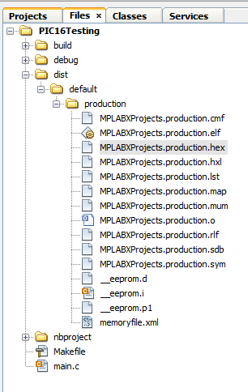

# 0x17 - Blink an LED again

## Solution:

- [Solution](solution/solution.md)

## Resources:

- Follow the [setup instructions](../../syllabus.md#setup) from the syllabus if not done already

- You should have the following installed:

  - [MPLABX IDE](https://microchipdeveloper.com/install:mplabx-lin64)
    - [Installation Guide](https://microchipdeveloper.com/mplabx:installation)
  - [MPLABX IDE Dependencies](https://microchipdeveloper.com/install:mplabx-lin64)
  - [XC8 Compiler](http://www.microchip.com/mplabxc8linux)
    - [Installation Guide](https://www.microchipdeveloper.com/xc8:installation)
  - [balenaEtcher](https://www.balena.io/etcher/)

- General Resources:

  - [PIC16 Pin Diagram](http://ww1.microchip.com/downloads/en/DeviceDoc/41287D.pdf)
  - [PIC16 Architecture](http://ww1.microchip.com/downloads/en/DeviceDoc/41291F.pdf)
  - [RaspberryPi Pinout](https://pinout.xyz)
  - [XC8 Compiler User Manual](http://ww1.microchip.com/downloads/en/devicedoc/50002053g.pdf)
  - [XC8 Compiler Delays](resources/XC8_delay.pdf)

## Objective

Starting fresh with a new microcontroller, use the available documentation and tools to:

- Apply learned knowledge of basic electronic components and previous microcontrollers
- Develop & implement a basic program (light an LED)
- Understand basic low-level timer operation
- Using the IDE as a guide, understand the 'C'-like underpinnings of microprocessor IDEs

You will be bread-boarding the following microprocessor from your lab kit:



## Steps:

### 0. Install development tools:

See `Resources` section above for this.

### 1. Get started with the IDE:

1. Open MPLABX IDE (search for `mplab` in your VM):


2. Start a new project (File > New Project > Microchip Embedded > Standalone Project)

3. In the new project window, select the `Mid-Range 8-bit MCUs` & find your PIC chip model number in the `Device` drop down. Then specify your PICKIT 4 programmer in the `Tool` dropdown:



4. Select the XC8 compile you installed & specify the location/name of your project in the final window:



### 2. Get your Raspberry Pi ready to program

1. Use balenaEtcher to flash your SD card with the provided `pickleKitMinimized.img` from [hardware.cnodp.dev](https://hardware.cnodp.dev/).



2. Put the SD card into the slot on the RapsberryPi and plug power into the micro-USB slot. The first time you boot this image, it will need to expand it's filesystem to fill the full SD card. Wait until the green LED near the power connector stops flashing then unplug power from the RaspberryPi, and plug it back in. 

3. Connect your raspberry pi to your laptop using the ethernet cable in your lab kit.

4. Manually assign an IP address to your ethernet interface in the range 10.10.10.0/24 that is not 10.10.10.1 or 10.10.10.10.

5. Confirm that you can SSH into the raspberry pi at 10.10.10.10 as user: pi / pass: raspberry.



### 3. Setup your breadboard with a basic circuit and connect the :

**NOTE:** Be gentle inserting the PIC microprocessor into the breadboard! If you break the chip, the TAs will be <u>mad</u> at you!

Use your prior knowledge of blinking LEDs on an Arduino and build a blink circuit on one of the I/O pins:

1. Identify an I/O pin to use in the PIC chip (see the **Resources** section for a pinout diagram)
  - Which physical pin (e.g. 1-28) is it on the chip? ________
  - What is the pin label in the datasheet (e.g. CLK1/TST0, etc.) _________
2. Hook up the PIC to the RapsberryPi. The pickleKit image uses the pinout:
  - VPP = GPIO 4
  - PGM = GPIO 22
  - PGC/ICSPCLK = GPIO 10
  - PGD/ICSPDAT = GPIO11
  - VCC (**3.3V**) = Pin 1
  - GND = Pin 6
3. VPP **MUST** be pulled-up (connected to VCC) by a 50K&Omega; load. (Hint: Put resistors in series to get the correct resistance)
4. Test that you can interact with your microcontroller by running the command:
```bh
p14 id
```

Your response should look like:



If your response does not contain `PIC16F882` then find a TA and let them know.

### 4. Write a basic program to turn on your GPIO pin:

1. Based on that pin you selected to control your LED, how many pin modes can the pin be configured for? ________
2. Based on the pin you selected, what register/bit(s) do you need to set to configure it as an output to drive the LED? ________
3. What **memory address** maps to that register/bit(s)? _______
4. What register controls the **pin direction** of your GPIO register? _______
5. Which bit in this register controls your specific GPIO pin? _______
6. Using what you know, create a new **main** C source file (File > New File) and wire some basic C code that will turn on your GPIO pin using this address

### 5. Test your connection:

1. Make sure your build environment is okay by compiling your C code (Production > Build Main Project) & look for the `BUILD SUCCESSFUL` message:



2. Navigate to Window > Target Memory Views > Configuration Bits to bring up a GUI window that configures useful registers. Make sure the output matches the following so the PIC processor clock is driven by the **internal oscillator**. Additonally, make sure that low voltage programming (LVP) mode is turned **ON**. If LVP mode is turned off you will need a TA to reset your chip.


3. Select the `Generate Source Code to Output` button to create `#pragma` statements to configure the PIC when programming. Copy and paste these into your source code.

4. Navigate to Files Tab. In dist > default > production find the file named `MPLABXProjects.production.hex`. This is the file contains instructions to place your program into the microcontroller's memory.



5. Move the contents of `MPLABXProjects.production.hex` to a file located on your raspberry pi. For example: `gpioOn.hex`

6. Program your microcontroller with the command: 
``` sh
p14 select PIC16F882 program gpioOn.hex
```

- `p14` is the flashing program
- `select PIC16F882` tells p14 which microcontroller we are using
- `program gpioOn.hex` tells p14 to program the microcontroller with the contents of the file gpioOn.hex

6. Using your multimeter, make sure there is a positive voltage on your GPIO pin (should be approximately 3.3v)

### 6. Blink an LED:

1. Wire up an LED **and a current limiting resistor** to your GPIO pin to see it light up
2. How do you implement a `delay()` function on the PIC chip (see **Resources** section for hints)?
3. Add a `delay()` function to toggle the LED at 0.5 second intervals in an infinite loop (LED flashes every second)


## `H@k3rm@n` Challenge:

**WARNING:** These problems are at the `H@k3rm@n` level. They are not required.

### 1. Time is Relative

Use a 555 timer circuit as the input clock source for the PIC instead of the internal oscillator so you can vary the LED flashing frequency manually at runtime to "visually" see the CPU clock rate.

- [Solution](solution/hackerman.md)
