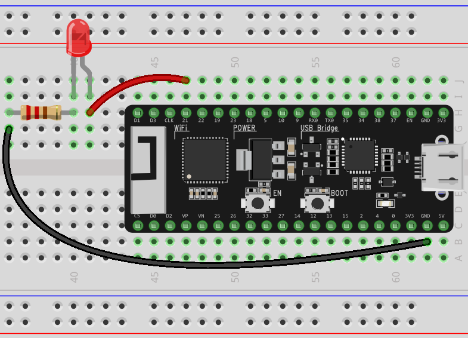
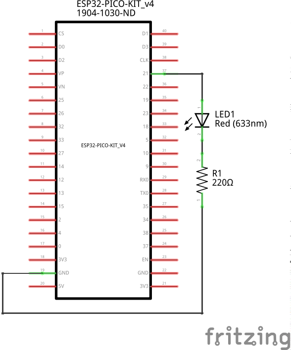
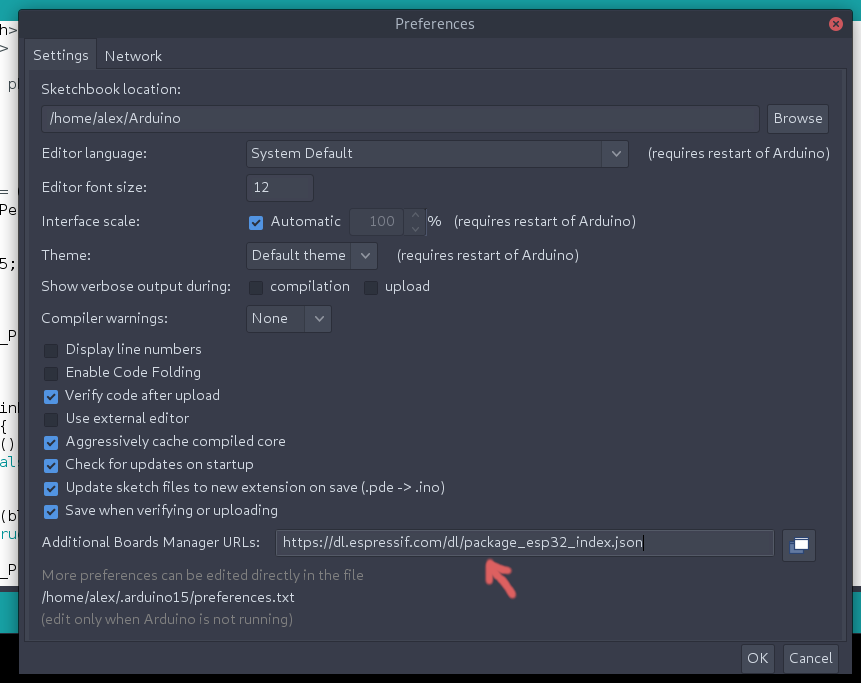
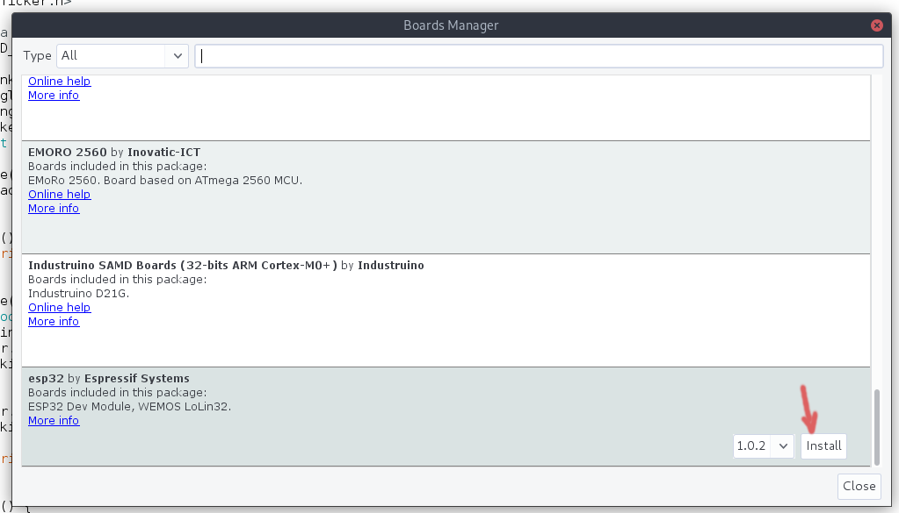
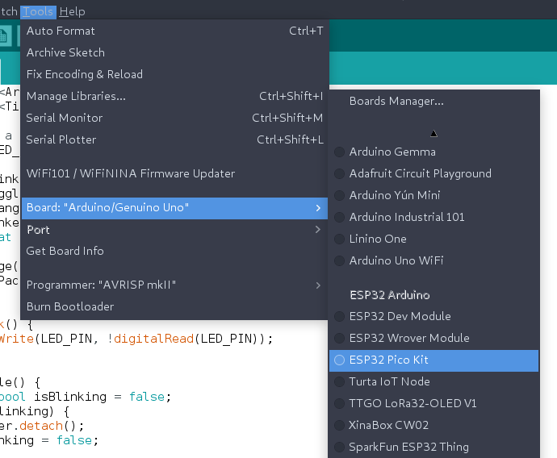
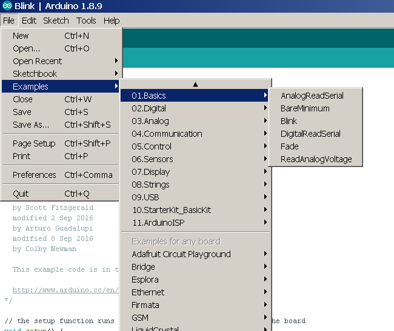

# 0x18 - Blink an LED again2

## Solution:

Solution is shown by completing the lab steps.

## Resources:

- Follow the [setup instructions](../../syllabus.md#setup) from the syllabus if not done already.

## Objective

Demonstrate programming the ESP32 with the Arduino IDE to blink an LED:

## Steps:

### 1. Assemble the circuit:

**NOTE:** Be mindful of the polarity of the LED!

### 2. Add the ESP32 Board Library to the Arduino IDE:

Start Arduino and open File > Preferences. Enter https://dl.espressif.com/dl/package_esp32_index.json into Additional Board Manager URLs field. You can add multiple URLs, separating them with commas:

Open the Boards Manager by navigating to Tools > Board and install the esp32 platform (search `esp` to bring up the library):

Connect your ESP32 chip to your VM using the USB micro cable & select **ESP32 Pico Kit** board by navigating to Tools > Board:

### 3. Open the Blink project in the Arduino IDE:

Arduino comes with many prebuilt code examples. We are going to use the pre-made `Blink` program. Open it as follows:

### 4. Modify the example to use the GPIO:

The ESP32 Pico Kit has an on-board led to indicate power but it is not programmatically addressable/controllable. Modify the example to use **GPIO pin 21** that the LED is connected to.

### 5. Compile and upload the `Blink` program to your ESP32:

Press the **Upload** button to upload the code to the board (you can also press the **Verify** button first to check for compiler errors, but this will be done when you select **Upload** as well). After the program is compiled and written to the board you should now have a blinking LED!

## `H@k3rm@n` Challenge:

**WARNING:** These problems are at the `H@k3rm@n` level. They are not required.

### 1. CLI || GTFO

As a `H@k3rm@n`, you do not like GUIs... All they do is abstract away functionality. In this case, _a lot_ is abstracted away from you. The [ESP32 Arduino library](https://github.com/espressif/arduino-esp32) is a meticulous wrapper around an entire SDK for the ESP32 written by Espressif! This wrapper was meant to allow for the ESP32 to conform to the standard Arduino library for use by script kiddies. You are _not_ a script kiddie right? Implement the `Blink` program without the Arduino IDE or ESP32 Arduino library (meaning, use the ESP32 SDK directly).

**NOTE:** This step is an **important baby step** before attempting the next lab's challenge...

**HINT:** You may want to take a look [here](https://docs.espressif.com/projects/esp-idf/en/latest/esp32/get-started/index.html) for setting up your environment...

- [Solution](solution/hackerman.md)
