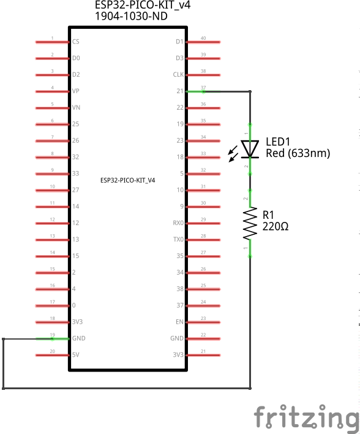
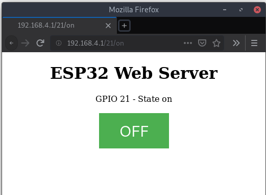

# 0x19 - ESP32 Web Server

## Solution:

- [Solution](solution/solution.md)

## Resources:

- Follow the [setup instructions](../../syllabus.md#setup) from the syllabus if not done already.

## Objective

Demonstrate the ESP32's ability to act as an IoT device to control a LED circuit remotely.

## Steps:

### 1. Assemble the circuit:

**NOTE:** Be mindful of the polarity of the LED!

### 2. Import the supplied project in the Arduino IDE:

Open a new Arduino project in the Arduino IDE with File > New and copy the `Blink` program from the previous lab to use as a starting point.

### 3. Modify the program:

Add functionality to control the LED remotely over WiFi. A user on your ESP32 WiFi network should be able to go to a web page and remotely turn off and on the LED on the ESP32. Here is an example of what that web page might look like:

Here are some helpful resources to get you moving:

- [How to use the Arduino `WiFi` library with ESP32](https://randomnerdtutorials.com/esp32-useful-wi-fi-functions-arduino/)
- [How to serve HTTP using the Arduino `WiFi` library](https://www.arduino.cc/en/Tutorial/LibraryExamples/WiFiWebServer)

### 4. Compile and upload your program to the ESP32:

Press the **Upload** button to upload the code to the board (you can also press the **Verify** button first to check for compiler errors, but this will be done when you select **Upload** as well).

### 5. Connect to your ESP32

With a WiFi capable device, scan for the SSID that you chose for your design in **Step 3**. Connect to your device and visit the base [IP address](https://www.arduino.cc/en/Reference/WiFiLocalIP) of the ESP32 (http://192.168.4.1).

## `H@k3rm@n` Challenge:

**WARNING:** These problems are at the `H@k3rm@n` level. They are not required.

### 1. WiFi DoS

Turn the ESP32 into a Wifi DoS device. Test it out by preventing others from controlling their LEDs with their ESP32s :wink:

**NOTE:** Lab 0x18's `H@k3rm@n` challenge is a prerequisite for this challenge

- [Solution](solution/hackerman.md)
