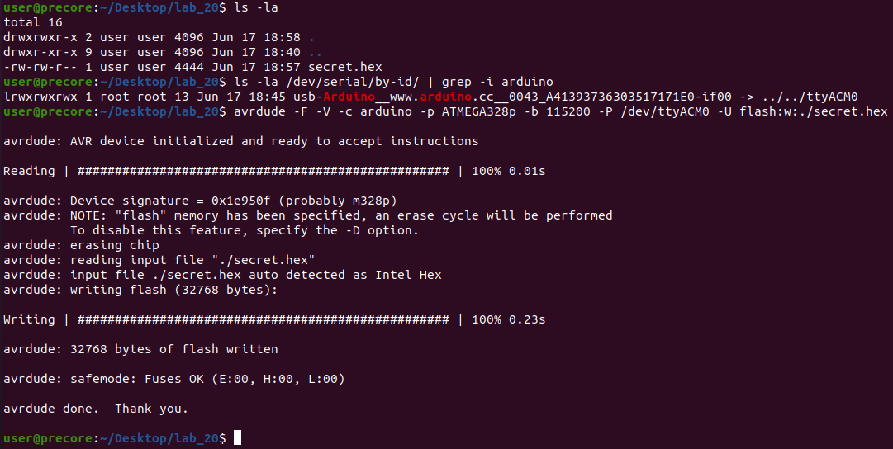
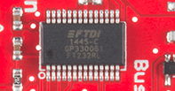
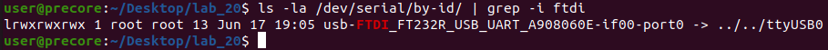
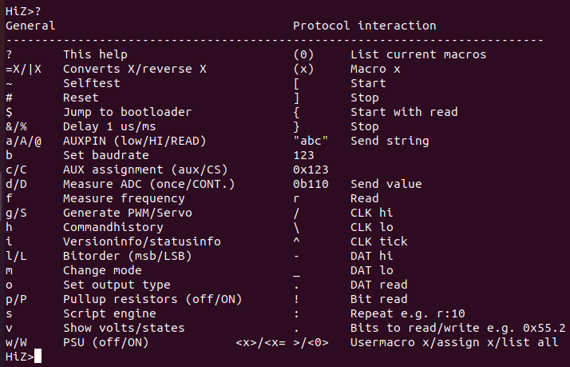
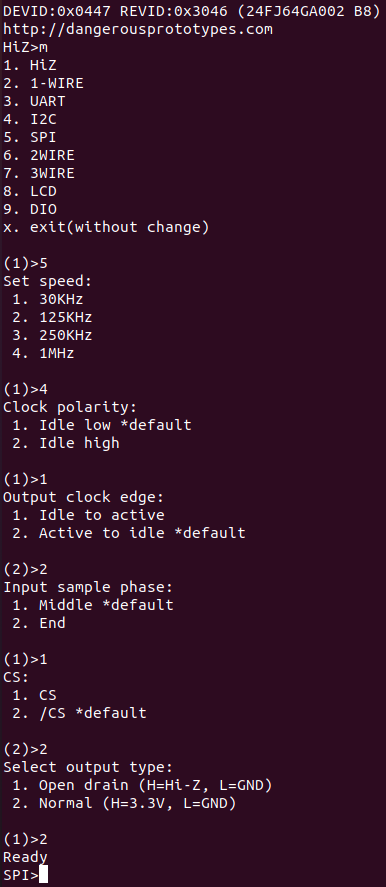
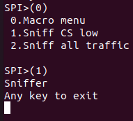
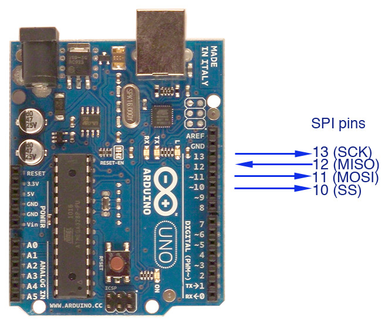
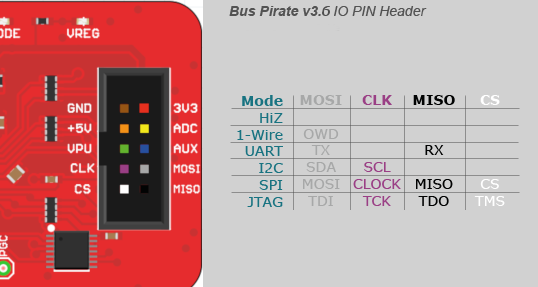

# 0x20 - SPI

## Solution:

- [Solution](solution/solution.md)

## Resources:

- Follow the [setup instructions](../../syllabus.md#setup) from the syllabus if not done already.
- Follow the [readme instructions](https://github.com/avrdudes/avrdude/) from the avrdude github to install it on your platform
- [Bus Pirate SPI Configuration Guide](http://dangerousprototypes.com/blog/bus-pirate-manual/bus-pirate-spi-guide/)

## Objective

Demonstrate connecting to a SPI bus and capturing traffic using the Bus Pirate.

## Steps:

### 1. Flash the Firmware:

For this lab, you will be capturing the SPI traffic sent from an Arduino. First flash the Arduino with the **compiled** firmware hex image using the following command template:

- [Download `secret.hex`](resources/secret.hex)

```bash
avrdude -F -V -c arduino -p ATMEGA328p -b 115200 -P <arduino_dev_path> -U flash:w:<path_to_secret.hex>
```

For example, if my Arduino is located at `/dev/ttyUSB0` in my Ubuntu VM and I downloaded `secret.hex` to `/tmp`, my command would be the following to flash my Arduino:

```bash
avrdude -F -V -c arduino -p ATMEGA328p -b 115200 -P /dev/ttyUSB0 -U flash:w:/tmp/secret.hex
```

You can identify which device port your Arduino is on using the following command in the Ubuntu VM:

```bash
ls -la /dev/serial/by-id/ | grep -i arduino
```

After flashing the firmware, you should see the following:



### 2. Connect the Bus Pirate:

The **Bus Pirate** is capable of talking several protocols, including SPI. To use it as a SPI sniffer, you will need to do some configuration.

The Bus Pirate itself implements UART via it's built-in USB-to-Serial chip ([FTDI 1445-C](https://www.ftdichip.com/Support/Documents/DataSheets/Cables/DS_USB_RS232_CABLES.pdf)) to interface with your computer.



Plug in the Bus Pirate to your Ubuntu VM and use the same command to find its device node path:

```bash
ls -la /dev/serial/by-id/ | grep -i ftdi
```



Though there are several programs you can use to interact with the serial device (such as putty, minicom, or pyserial), this lab is written to use **gnu `screen`**. Connect to the Bus Pirate as follows **using the path you found from the previous command**:

**NOTE:** 115200 is the Bus Pirate's default baud rate

**NOTE:** Using `/dev/ttyUSB0` from the test output given in the image above

```bash
screen /dev/ttyUSB0 115200
```

If everything is connected correctly and you are attaching to the correct device, you will see a blank screen. Press the enter or return key to see the Bus Pirate Prompt. Then enter the `?` command to see the following help menu:



### 3. Configure the Bus Pirate:

Enter the `m` command to change the mode and select `5` for SPI. Enter the following for options:

- `4` for *1MHz* Speed
- `1` for *Idle low* Clock polarity
- `2` for *Active to idle* Output clock edge
- `1` for *Middle* Input sample phase
- `2` for */CS* CS/SS active low
- `2` for *Normal (H=3.3V, L=GND)* Output Type



At the `SPI>` prompt. Enter `(0)` to show available macros and then enter `(1)` to sniff when CS is low (when the master is sending data). **You can exit the sniffing mode by sending any key**.

**NOTE:** To close the screen session, you can pull power from the Bus Pirate. This should terminate the screen session. If it does not, you can terminate the screen session by pressing `Ctrl+a` followed by `\` and then `y` to confirm.



### 4. Wiring the Bus Pirate to the Arduino:

With the Bus Pirate in SPI mode, you can hook up the pins on the Bus Pirate to the Arduino using the following references:

- Bus Pirate `GND` to `GND` on the Arduino
- Bus Pirate `MISO` to `MISO` on the Arduino
- Bus Pirate `MOSI` to `MOSI` on the Arduino
- Bus Pirate `CS` to `SS` on the Arduino
- Bus Pirate `CLK` to `SCK` in the Arduino





### 5. Reading SPI Traffic Using the Bus Pirate:

With the Bus Pirate in SPI mode and connected to the Arduino, you should see data appearing in the screen session. For reading SPI data, the Bus Pirate formats the sniffed data like this: `[0xXX(0xXX)]`

- `[`: CS enable (CS is **low**)
- `]`: CS disable (CS is **high**)
- `0xXX`: MOSI pin read
- `(0xXX)`: MISO pin read

For example, if just the master is sending `0xAABBCC` over the SPI bus, the Bus Pirate will capture the data like so:

```
[0xAA(0x00)0xBB(0x00)0xCC(0x00)]
```

If just the slave is sending `0xAABBCC` over the SPI bus, the Bus Pirate will capture the data like so:

```
[0x00(0xAA)0x00(0xBB)0x00(0xCC)]
```

### 6. Decipher the SPI Secret Message:

There is a secret hidden in the SPI data being transmitted. The secret is encoded, but the intern that encoded it got lazy and decided to prepend the decryption key to each transmission. Your mission, should you choose to accept it, is to capture and decipher the hidden message.

**HINTS:**

- The intern that created the encryption key enjoys a good steak
- The message is transmitted every 5 seconds
- [CyberChef](https://gchq.github.io/CyberChef) can be useful here
- If you see `couldn't keep up`, try resetting the Bus Pirate with the `#` command and re-do the configuration

## `H@k3rm@n` Challenge:

**WARNING:** These problems are at the `H@k3rm@n` level. They are not required.

### 1. _boss music starts ..._

That was too easy right? That is what I was thinking ... There is another hidden message on the Arduino that only a `H@k3rm@n` can find ... **Find the flag**.

**HINT:** Open the Arduino IDE's Serial Monitor at 9600 Baud

- [Solution](solution/hackerman.md)
