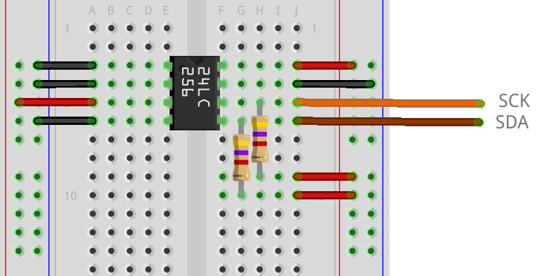
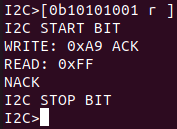
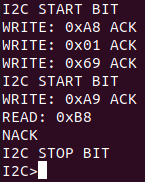
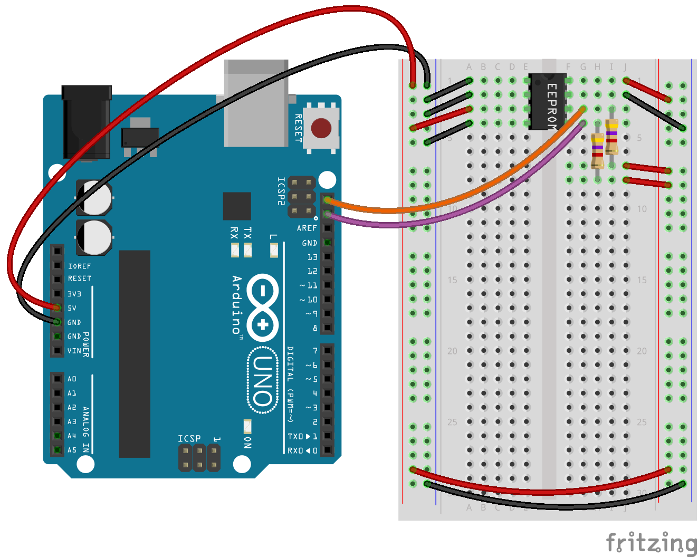

# 0x21 - I2C

## Solution:

- [Solution](solution/solution.md)

## Resources:

- Follow the [setup instructions](../../syllabus.md#setup) from the syllabus if not done already.
- Follow the [readme instructions](https://github.com/avrdudes/avrdude/) from the avrdude github to install it on your platform
- [24LC256 Datasheet](resources/24LC256_datasheet.pdf)
- [Bus Pirate I2C Documentation](http://dangerousprototypes.com/docs/Bus_Pirate_I2C)

## Objective:

Demonstrate how to interface with and detect I2C devices on the bus. Understand the basic steps for communicating on an I2C bus.

## Steps:

### 0. Read the datasheet for the IC:

Read the [24LC256 Datasheet](resources/24LC256_datasheet.pdf) and answer the following questions:

- What is the function of each of the pins?
- How do you program the I2C address of the IC?
- What operating frequencies does the IC support?
- What is the difference between a random and sequential READ operation?
- Does the IC send an ACK the after the transmission of a byte for a READ operation?
- Does the IC send an ACK the after the transmission of a byte for a WRITE operation?

### 1. Assemble the Circuit:

The circuit for the IC should be setup as follows:

**NOTE:** The resistors are 470 Ohm (Just use 2x 220 Ohm in series)



Pins 1-3 are A0, A1, and A2 respectively. These are the user chip select lines to program the I2C address of the IC. These set the lower 3 bits of the chip's I2C address, since there may be multiple other 24LC256s on the bus. In the example diagram provided above, we set A2-A1-A0 to 1-0-0.

- **Look through the IC datasheet to calculate the expected I2C address of the IC using a different pinout than the one shown in the diagram**

We will be using the Bus Pirate to interact with the I2C device first. Connect the Bus Pirate to the IC as follows:

- Bus Pirate "MOSI" is SDA (the I2C data line)
- Bus Pirate "CLK" is SCL (the I2C clock line)
- You will also use the Bus Pirate's GND and 5V headers.


### 2. Configure the Bus Pirate and Interact with the Target IC Manually:

The Bus Pirate supports many modes of interaction with external targets. It's necessary to set the correct mode with options, instead of blindly poking a target device!

**NOTE:** See lab 0x20 for help with connecting to the Bus Pirate over UART from the Ubuntu VM

- Set the mode to I2C & speed to 400KHz: `m` & `4`
- Enable the 5v power supply: `W`
- List the macros available in I2C mode: `(0)`
- Run the macro that will verify the I2C address of the IC: `(1)`

**Was the I2C address displayed the one you calculated in the previous step?** The format of the output will look like the following with `0xBB` being the I2C address:

```
I2C>(1)
Searching I2C address space. Found devices at:
0xAA(0xBB W) 0xCC(0xBB R)
```

Read the datasheet and figure out how to perform a **READ** from the IC using the Bus Pirate. Your command should have the following format (See the **Resources** section for I2C Bus Pirate documentation):

**NOTE:** The `xxxx` below should include your A2-A1-A0 bits and the READ/WRITE command bit for the byte

```
[ 0b1010xxxx r ]
```

You should get something back like the following (image assumes A2-A1-A0 is 1-0-0. **Yours should be different!**):



**Why is the result `0xFF`?** ([RTFM](https://en.wikipedia.org/wiki/RTFM) here guys ...)

Now, figure out how to set the address register over I2C and perform a random read operation to get something other than `0xFF` at the address `0x0169`. Your output should look like the following:

**NOTE:** The image below assumes A2-A1-A0 is 1-0-0. **Yours should be different!**

**NOTE:** The byte value returned by the IC _may_ be different for you (value depends on the `H@k3rm@n` challenge). As long as it is not `0xFF`, then your read command works. _However_, if you are getting `0xFF` back, just try another address!



### 3. Bus Sniffing:

Connect the Arduino to the Ubuntu VM and upload the following basic external EEPROM reading sketch for the IC:

- [Download `lab.hex` to your Ubuntu VM](resources/lab.hex)

Upload `lab.hex` to your Arduino the same way you did in lab 0x20 for SPI:

```bash
avrdude -F -V -c arduino -p ATMEGA328p -b 115200 -P <arduino_dev_path> -U flash:w:<path_to_lab.hex>
```

Connect the Arduino to the IC as follows:

**NOTE:** The resistors are 470 Ohm (Just use 2x 220 Ohm in series)



Allow for your Bus Pirate to share the SDA, SCL, and GND lines with the Arduino (**Disconnect the 5V line from the Bus Pirate !!!!!!!! Only the Arduino should be providing power !!!!!!!!**). This will allow for sniffing of the traffic between the Arduino and the IC.

Now, using the Bus Pirate, run the I2C macro `(2)` to see the raw I2C transmission being sniffed off the bus. Reset the Arduino by pressing the button on the board and you should see data appear on the screen. Reset the Arduino again to see the transaction again.

**Describe what the Arduino code is doing to the IC based on the sniffed I2C traffic**

**NOTE:** Be sure to capture the transaction a few times! The Bus Pirate I2C sniffer can sometimes report bad data!

## `H@k3rm@n` Challenge:

**WARNING:** These problems are at the `H@k3rm@n` level. They are not required.

### 1. _show me the money_

There is a `H@k3rm@n` flag stored in the first 10KiB on the EEPROM IC. Find it.

**HINT:** Make sure you are not **writing** to the EEPROM!!!! (duh)

- [Solution](solution/hackerman.md)
