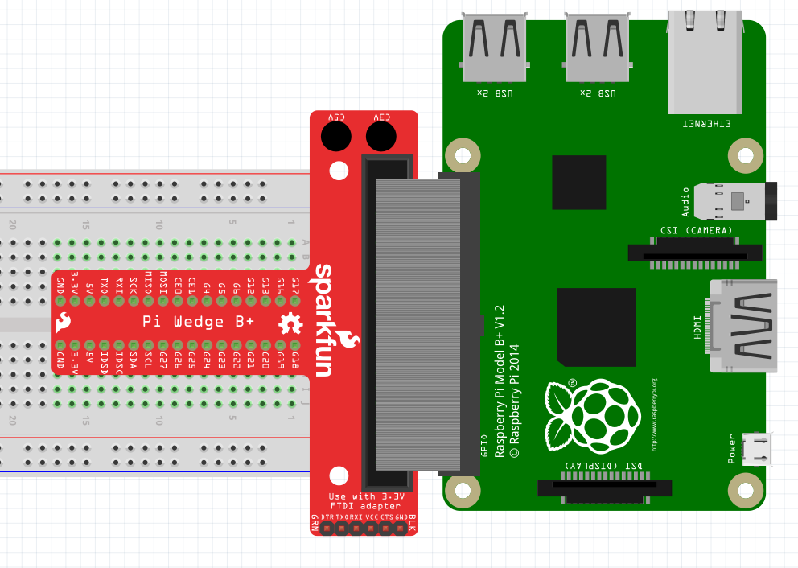
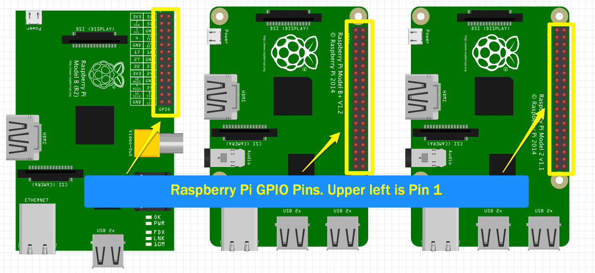
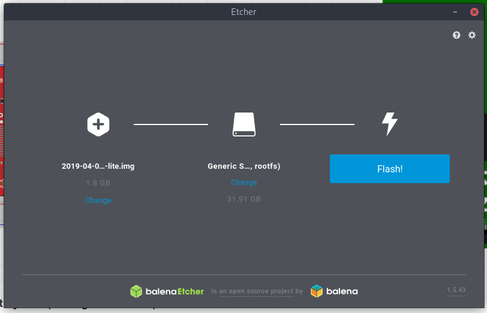
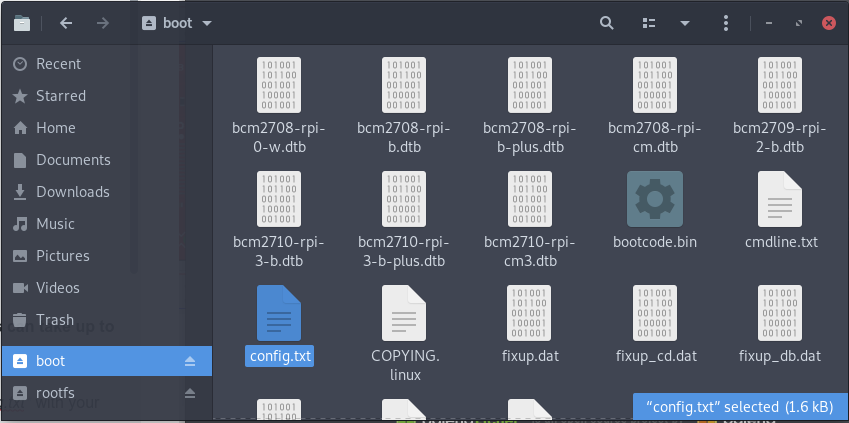
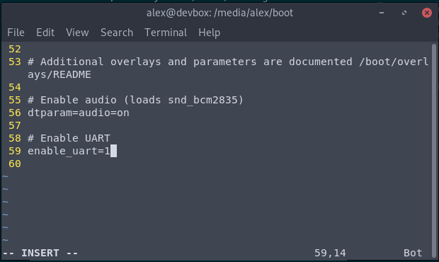
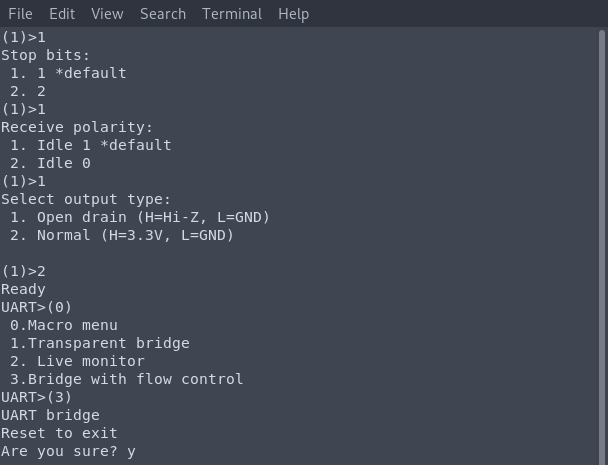
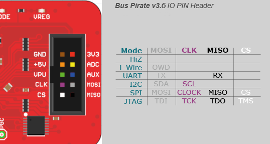
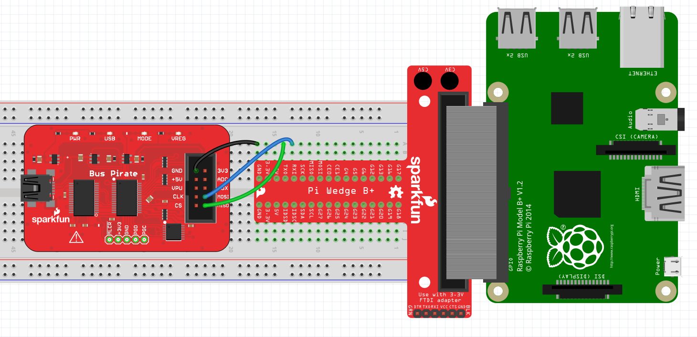
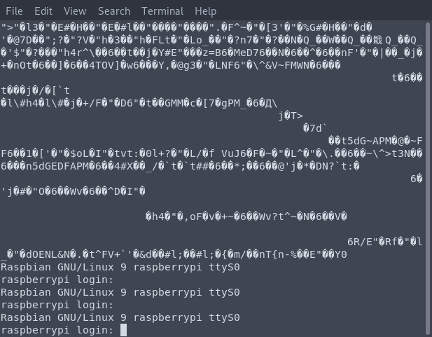

# 0x30 - UART Shell

## Solution:

Solution is shown by completing the lab steps.

## Resources:

- Follow the [setup instructions](../../syllabus.md#setup) from the syllabus if not done already.
- [Bus Pirate UART Documentation](http://dangerousprototypes.com/docs/UART)

## Objective:

Demonstrate connecting to an embedded Linux device via UART/RS232 to access a shell.

## Steps:

### 1. Construct the Circuit:

Build the following circuit:



**NOTE:** GPIO pin #1 is the top left pin of the GPIO header. **Make sure you don't connect the ribbon cable incorrectly!** Also, **DO NOT BREAK THE PI GPIO HEADER PINS**!



### 2. Configure the Target System (Writing the SD Card):

Using the USB Micro SD card reader, insert the 16 GB Micro SD card into your computer and connect it to your Ubuntu VM. Next open [balenaEtcher](https://www.balena.io/etcher/) by running the following command:

```bash
/opt/balenaEtcher-1.5.120-x64.AppImage
```

Now download the IMG file [here](resources/2019-04-08-raspbian-stretch-lite.img.xz) and transfer it to your Ubuntu VM. Now unzip it:

```bash
xz --decompress 2019-04-08-raspbian-stretch-lite.img.xz
```

Then select the IMG file and flash it to the SD card as depicted in the image below using balenaEtcher (SD card _should_ be mounted at `/dev/sdb` in your VM):

**NOTE:** This can take up to 15 minutes



Once the image is successfully written to the SD card, you should be able to mount have two new drives: *rootfs* and *boot.* Open the **boot** drive and edit the file *config.txt* with your editor of choice.



At the bottom of the file, add the following configuration:

```
# Enable UART
enable_uart=1
```



This will enable the UART interface on Pi's GPIO pins. Save the file and eject the SD card from your computer. Insert the SD Card into the Raspberry Pi's SD card slot.

**NOTE:** Due to how the UART interface is implemented on the Pi, the UART baud rate is directly proportional to the Pi's CPU clock speed. In order to provide a stable baud when operating, the Pi's core CPU frequency will be locked to 250MHz while UART is enabled.

### 3. Configure The Host System and Bus Pirate:

Unless your computer is equipped with a built-in UART port (looking at you [novena](https://www.crowdsupply.com/sutajio-kosagi/novena) owners), you will need a Serial to USB interface to communicate via UART to the Pi. The **Bus Pirate** is capable of talking several protocols, including UART. To use it as a UART interface, you will need to do some configuration.

**NOTE:** See lab 0x20 for help with connecting to the Bus Pirate over UART from the Ubuntu VM

Enter the `m` command to change the mode and select `3` for UART. Enter the following for options:

- `5` for a *9600* baud rate (the Pi 3 default)
- `1` for *8, NONE* under Data bits and parity
- `1` for *1* under Stop bits
- `1` for *Idle 1* under Receive polarity
- `2` for *Normal (H=3.3, L=GND)* under Output Type

At the `UART>` prompt. Enter `(0)` to show available macros:

```
UART>(0)
0.Macro menu
1.Transparent bridge
2.Live monitor
3.Bridge with flow control
```

Now enter `(3)` to enter bridge mode with flow control and enter `y` to confirm. The terminal is now ready to receive input from your device:



### 4. Wiring the Bus Pirate to the Pi:

With the Bus Pirate in UART 3.3v mode bridged to your running screen instance,  you can hook up the pins on the bus Pirate to the 3.3v serial port of your embedded device using the following reference.

- Bus Pirate `GND` to `GND` on the Pi
- Bus Pirate `MISO` to `TX` on the Pi
- Bus Pirate `MOSI` to `RX` on the Pi



Connect the three required wires to the **Bus Pirate** and **Pi Wedge** breakout on the breadboard:

**WARNING:** Make sure you have the **Bus Pirate's RX pin** connected to the **Pi's TX pin** and the **Bus Pirate's TX pin** connected to the **Pi's RX pin**! If you accidentally connect both TX pins together, one side could drive high while the other drives low and you will have a short to ground which can harm one or both devices.



### 5. Booting the Pi:

While keeping an eye on your UART terminal with the Bus Pirate, boot the Raspberry Pi by connecting the USB Micro cable to it. You should see the red *"PWR"* led stay solid to show power, and the green *"ACT"* will blink rapidly showing disk activity.

The terminal will fill with random characters for a bit. After it appears to settle down, hit the `enter` or `return` key a few times. You should then be greeted with the Rasbian login prompt:

```
Raspbian GNU/Linux 9 raspberrypi ttyS0
raspberrypi login:
```

**NOTE:** If hitting `enter` or `return` does not drop you to a login prompt, you can try closing and reopening the session. You can close the screen session pressing `Ctrl+A` followed by `\` and then `y` to confirm.



### 6. Interacting with Embedded Linux through the UART Serial Connection:

You can now interact with the Raspberry Pi the same way you would through a standard terminal session.

```
Username: pi
Password: raspberry
```

Feel free to poke around! When you are finished, make sure to cleanly shutdown the Pi to minimize the risk of corrupting the SD card:

```
pi@raspberrypi:~$ sudo shutdown -h now
```

Once the green light stops blinking, you can remove power form the Pi. To close the screen session, you can pull power from the Bus Pirate. This should terminate the screen session. If it does not, you can terminate the screen session by pressing `Ctrl+A` followed by `\` and then `y` to confirm.

## `H@k3rm@n` Challenge:

**WARNING:** These problems are at the `H@k3rm@n` level. They are not required.

### 1. **_"It's a UNIX system! I know this!"_**

Your friends only got a UART shell on the Pi ... But you are a `H@k3rm@n` and know that this Pi has built-in WiFi ... Figure out how to enable it and connect to your Pi using SSH instead of UART.

**NOTE:** If you make a solution for this, let the instructors know! This one has not been done yet and your solution could become **THE** solution ;)
