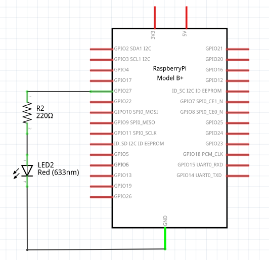
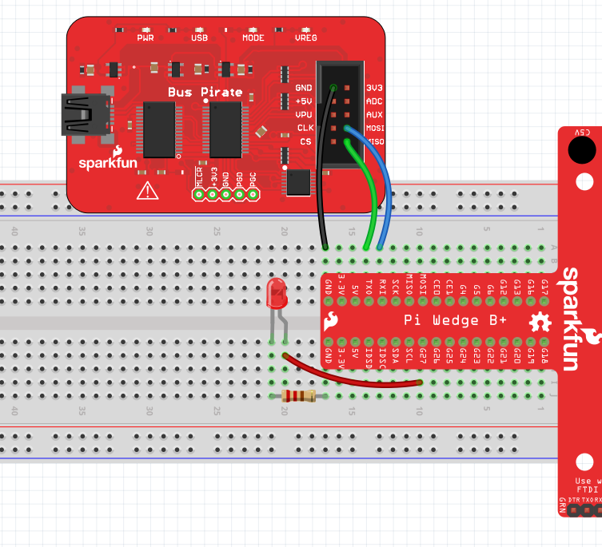

# 0x31 - Blink an LED again<sup>3</sup>

## Solution:

- [Solution](solution/solution.md)

## Resources:

- Follow the [setup instructions](../../syllabus.md#setup) from the syllabus if not done already.

## Objective:

Demonstrate controlling General Purpose Input Output (GPIO) on the Raspberry Pi 3 B+ to blink an LED.

## Steps:

### 1. Wire up the Circuit:

Connect the **Raspberry Pi** to the breadboard with the **Pi Wedge** and connect the **Bus Pirate** to the Pi to communicate over UART (See the previous lab for issues here). Choose one of the GIPIO pins (*labeled with "G##" on the **Pi Wedge***) to wire up an **LED** with the required series resistor for a 3.3v source.



Your setup should resemble the following:



### 2. Connect to the Raspberry Pi over UART:

Using the steps outlined in the previous lab, power up and connect to the **Raspberry Pi** using the **Bus Pirate's** UART mode & login.

### 3. Controlling the Pi's GPIO:

The Pi's GPIO ports can be controlled from the command line (i.e. BASH), Python scripts, and C/C++ programs. There are 17 GPIO ports available on the Pi. Some of them have special purposes or special hardware configurations and should be avoided for normal use (see [pinout.xyz](https://pinout.xyz/) for more details).

**Controlling GPIO from BASH:**

The following commands should be run as root (`sudo bash`). This code sets up pin 27 to be an output, sets the pin high and then sets it low:

```bash
# exports pin to userspace
echo "27" > /sys/class/gpio/export

# sets pin 27 as an output
echo "out" > /sys/class/gpio/gpio27/direction

# sets pin 27 to high
echo "1" > /sys/class/gpio/gpio27/value

# sets pin 27 to low
echo "0" > /sys/class/gpio/gpio27/value
```

This next snippet sets up pin 4 to be an input, then reads the value of the input:

```bash
echo "4" > /sys/class/gpio/export
echo "in" > /sys/class/gpio/gpio4/direction
cat /sys/class/gpio/gpio4/value
```

**Controlling GPIO from Python**:

The GPIO pins are exposed to python through a number of libraries. The one used in this lab (and included in Raspbian Lite's Python 2) is `RPi.GPIO`:

```python
import RPi.GPIO as GPIO
import time # for pausing between output values

GPIO.setmode(GPIO.BCM)
```

The reason we use `GPIO.setmode()` here is because there are actually two labels for all of the pins, Broadcom (BCM) and board (BOARD). The board option will let you refer to the pin's actual number on the board, and the Broadcom number is the actual pin number that the Broadcom chip considers it to be. It seems to be that BCM specification is the *actual* pin number listed on the Pi Wedge, so we'll use that.

This code sets up pin 27 to be an output, sets the pin high, pauses, sets it low, pauses, and then cleans up the GPIO state:

```python
GPIO.setup(27, GPIO.OUT)
GPIO.output(27, GPIO.HIGH)
time.sleep(1)
GPIO.output(27, GPIO.LOW)
time.sleep(1)
GPIO.cleanup()
```

This next snippet sets up pin 4 to be an input, then reads the value of the input before cleaning up the GPIO state:

```python
import RPi.GPIO as GPIO

GPIO.setmode(GPIO.BCM)
GPIO.setup(4,GPIO.IN)
p4in = GPIO.input(4)
print("Pin 4: " + str(p4in))

GPIO.cleanup()
```

### 4. Write a Simple Blink Program:

Using either BASH or Python, write a simple blink program to blink the LED on and off at 1 second intervals.

## `H@k3rm@n` Challenge:

**WARNING:** These problems are at the `H@k3rm@n` level. They are not required.

### 1. **Well that was dumb ...**

Turning on GPIO using BASH and Python? Those are Script-Kiddie languages! As a `H@k3rm@n`, you want to know what is happening underneath to allow for this GPIO magic to happen ... Write C code to blink an LED by manually controlling the GPIO memory-mapped registers for the Pi.

**HINT:** The Python [`RPi.GPIO`](https://pypi.org/project/RPi.GPIO/) source code will be helpful here

**HINT:** The datasheet for the [BCM2835](https://www.raspberrypi.org/app/uploads/2012/02/BCM2835-ARM-Peripherals.pdf) SoC on the Pi will help with finding MMIO addresses

- Pg 6 for the MMIO base address for the **ARM Core**
- Pg 89 - 104 for the GPIO register bit field documentation

**NOTE:** If you make a solution for this, let the instructors know! This one has not been done yet and your solution could become **THE** solution ;)
