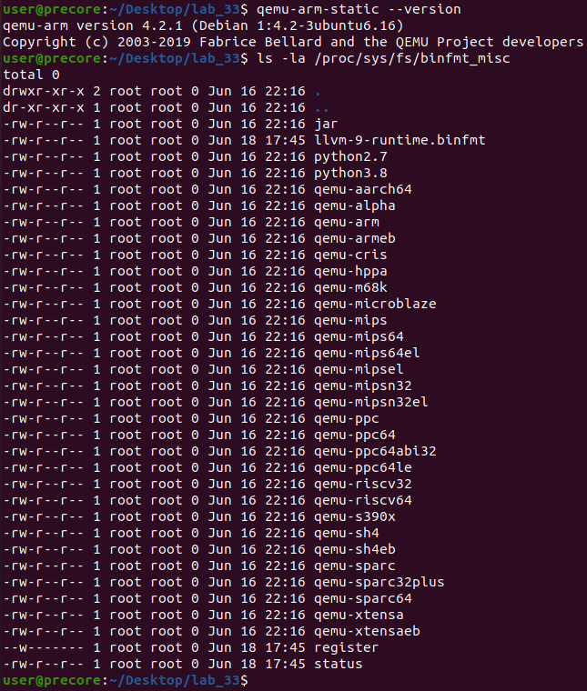
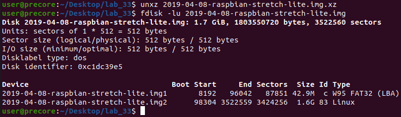
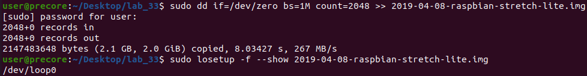
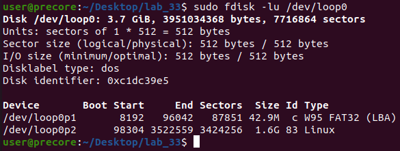
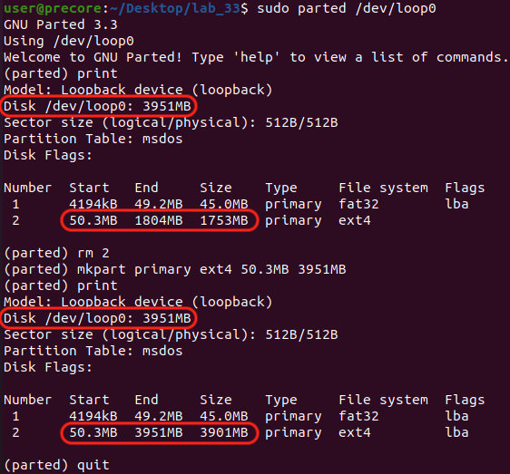
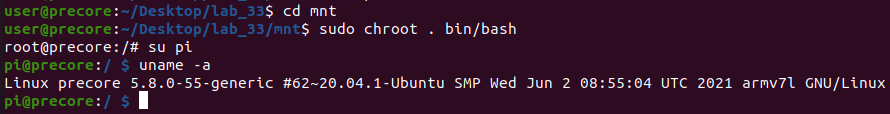

# 0x33 - QEMU

## Solution:

Solution is shown by completing the lab steps.

## Resources:

- Follow the [setup instructions](../../syllabus.md#setup) from the syllabus if not done already.

## Objective:

Imagine you have been given a disk image of an embedded Linux device that was pulled off of flash memory from hardware. Your task is to find a way to mount and emulate the system environment to see what vulnerabilities you can find ...

In this lab, we will set up an emulation environment which will emulate part of the Raspberry Pi Linux operating system by using [QEMU](https://www.qemu.org) and a disk image of the Raspberry Pi to run the cross-compiled binary from the previous lab "natively" in its environment on the Pi.

## Steps:

### 0. README:

It is often helpful when developing or assessing embedded devices to be able to directly run native binaries. In some cases, this is not possible or is inconvenient to do so on the target hardware. In this case, an emulator may enable faster cycling and bug detection than when developing directly on the device.

QEMU actually supports two different modes for running binaries; a "system" mode, which requires a complete system image to be created and booted (including possibly a modified kernel to run on the QEMU virtual machine); but has the advantage of more completely representing the system being emulated, and a "user" mode, which only emulates the binary in question and makes some fairly minimal assumptions to provide a "default" operating system environment for the binary to live in. This method is much faster in most cases, but unless the binary you are instrumenting is entirely self-contained, will usually run into _library dependency issues_.

In this lab, we will run a compromise between these two options which has been a successful approach for many in the past. We will be copying `qemu-static-arm` into the actual, uncompressed filesystem of the Pi. We will then use `binfmt-support` (mentioned in the previous lab!) to configure our system to automatically detect when binaries should use QEMU to host the executable. This gives us the advantage of not worrying about missing libraries and gives us most of the features of an actual Pi. It is also considerably faster than full-system emulation. For those interested, there are [other walk-throughs](https://github.com/wimvanderbauwhede/limited-systems/wiki/Raspbian-%22stretch%22-for-Raspberry-Pi-3-on-QEMU) which emulate the entire Pi in QEMU.

### 1. Setup:

Make sure you QEMU environmet is ready by running the following commands:

```bash
qemu-arm-static --version
ls -la /proc/sys/fs/binfmt_misc
```



Download the Pi image, extract it, and list its disk partitions:

- [Download Pi image](resources/2019-04-08-raspbian-stretch-lite.img.xz)

```bash
unxz 2019-04-08-raspbian-stretch-lite.img.xz
fdisk -lu 2019-04-08-raspbian-stretch-lite.img
```



### 2. Mounting & Modifying the Filesystem:

To mount the Pi's filesystem, we need to append some free space to be used at runtime:

```bash
sudo dd if=/dev/zero bs=1M count=2048 >> 2019-04-08-raspbian-stretch-lite.img # adds 2 GiB
```

To format this free space we just added, we need to mount the image as if it were a disk:

```bash
sudo losetup -f --show 2019-04-08-raspbian-stretch-lite.img
```



You can now inspect the Pi IMG file mounted as a Linux block device mounted under `/dev`:

**NOTE:** Notice how in the following disk information, the final sector of the Linux filesystem ends at sector 3522559 but there are 7716864 sectors in the IMG file. We need to expand this IMG file to account for this free space!

```bash
sudo fdisk -lu /dev/loop0 # NOTE: using loop0 for the examples. yours _may_ be different
```



**Use the `/dev` path returned from the `losetup` command** to modify it using `gparted` so we can expand the Pi partitions to account for the added free space:

**NOTE:** In this example, the 2 print command differences show how the filesystem was expanded!

```bash
sudo parted /dev/loop0 # NOTE: using /dev/loop0 but yours _may_ be different!
# NOTE: the following are gparted commands
print                             # list partition info
rm 2                              # remove partition 2
mkpart primary ext4 50.3MB 3951MB # make a new ext4 primary partition starting at 50.3MB ending at 3951MB
print
quit
```



Now that the partition tables have been expanded, we need to have the actual filesystem in the partition (ext4) account for that new space. Mount that partition directly and use Linux filesystem utilities to expand the ext4 filesystem node structure to include the new space:

**NOTE:** In the following command, `98304 * 512` represents the byte offset into the IMG file to the start of the Linux filesystem partition. The `fdisk` output columns show the starting **sector** number for each partition on the disk. We need to multiply by 512 (the size in bytes of each sector) to get the byte offset of the partition on the IMG file!

```bash
sudo losetup -f --show -o $((98304 * 512)) 2019-04-08-raspbian-stretch-lite.img
# NOTE: using /dev/loop11 but yours _may_ be different!
sudo e2fsck -v -f /dev/loop11
sudo resize2fs -f /dev/loop11
# detach all mounted IMG files
sudo losetup -D
```

Now we can mount the Linux filesystem directly and modify it:

```bash
# make the root filesystem directory
mkdir mnt
# mount the Linux filesystem
sudo mount 2019-04-08-raspbian-stretch-lite.img -o loop,offset=$((98304 * 512)),rw mnt
# mount the boot partition
sudo mount 2019-04-08-raspbian-stretch-lite.img -o loop,offset=$((8192 * 512)),rw,sizelimit=$((87851 * 512)) mnt/boot
# mount the runtime Linux system directories
sudo mount --bind /dev mnt/dev
sudo mount --bind /sys mnt/sys
sudo mount --bind /proc mnt/proc
sudo mount --bind /dev/pts mnt/dev/pts
```

You can now `cd` into `mnt` and modify the filesystem directly (you will need to `sudo su` first though)!

### 3. Emulating the Pi Linux OS with user-mode QEMU:

First copy over the **statically** compiled QEMU user-mode emulator into the mounted Pi filesystem. This is necessary so that we can still use the `binfmts` Linux kernel module to run QEMU for ARM binaries after we `chroot` into the Pi Linux filesystem:

```bash
sudo cp /usr/bin/qemu-arm-static mnt/usr/bin
```

Now, "enter" into the Pi's OS by using `chroot` to place us **into** the Pi filesystem:

```bash
cd mnt
sudo chroot . bin/bash
su pi
uname -a
```



Take a second to think about this weirdness we have achieved ... We have mounted the Linux filesystem for the Pi and are using the QEMU user-mode emulator to emulate the system binaries on the Pi natively inside your Ubuntu VM! You can now do native development for the Pi by cross compiling a binary, coping it into your mounted Pi filesystem, and then running it in the `chroot` environment managed by QEMU and the `binfmt` kernel driver!

### 3. Pr0fit:

Now copy over the cross-compiled binary from the previous lab into the mounted Pi filesystem and run it. Test out the functionality of this environment ... See what you can and cannot do. For example, try running the following:

```bash
/usr/bin/raspi-config
```

Then answer the following:

- Can you overclock your Pi via emulation? Did you expect to be able to?
- Try loading some kernel modules for Pi peripherals (SPI/I2C). Did it work? Try exiting from the config and see the terminal logs ...

Think about the emulation environment you set up and the limitations imposed ...

## `H@k3rm@n` Challenge:

**WARNING:** These problems are at the `H@k3rm@n` level. They are not required.

### 1. **Don't hate me, but ...**

Take your previous challenge's HTTP server and emulate it using user-mode QEMU ;)

**NOTE:** This challenge requires the previous 3 challenges to be complete before attempting!

**NOTE:** If you make a solution for this, let the instructors know! This one has not been done yet and your solution could become **THE** solution ;)
