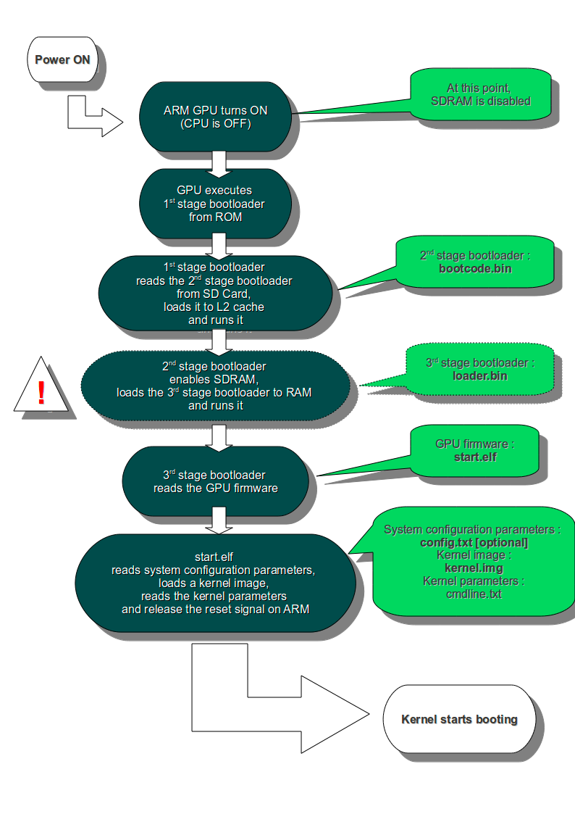

# 0x34 - UBoot

## Solution:

- [Solution](solution/solution.md)

## Resources:

- Follow the [setup instructions](../../syllabus.md#setup) from the syllabus if not done already.
- UBoot Command Line [Reference](http://www.denx.de/wiki/view/DULG/UBoot)

## Objective:

Modify your Pi to boot UBoot and use it to control raw system resources to demonstrate the power of embedded bootloaders such as UBoot and GRUB2.

## Steps:

### 0. README:

[UBoot](https://www.denx.de/wiki/U-Boot) (The Universal Bootloader) is a popular, feature rich, open source bootloader for embedded systems. While its primary purpose is to boot an operating system, such as Linux, it also provides many useful tools for developing and debugging embedded systems.

UBoot can be used to load an operating system from a variety of media and filesystem types - even over a network or serial connection. It also has tools for investigating the hardware environment and querying the existing firmware at a low level which may be useful to an embedded systems reverse engineer.

**UBoot is frequently flashed directly onto device ROM as a fail-safe so that the operating system can be re-loaded in the event the main OS becomes unusable** (for example, in the event of a failed firmware update).

### 1. The Raspberry Pi Boot Process:

The boot sequence of the Raspberry Pi is basically this (referencing the files found in the `boot` partition of your Pi's SD card):

**_Everything is run on the GPU until `kernel.img` is loaded on the ARM CPU(s)_**

- Stage 1 boot is in the on-chip ROM. It contains the eMMC drivers for communicating with the SD card you insert into the Pi to mount and read the `boot` partition. This ROM bootloader loads Stage 2 into the L2 cache. This is written by [Broadcom](https://www.broadcom.com/) and is proprietary.
- Stage 2 is `bootcode.bin`. It enables [SDRAM](https://en.wikipedia.org/wiki/Synchronous_dynamic_random-access_memory), loads [Device Tree](https://www.raspberrypi.org/documentation/configuration/device-tree.md) files off of the `boot` partition and knows about the ELF format. It loads Stage 3.
- Stage 3 is `start.elf`. It loads `kernel.img`. It then also reads `config.txt` and `cmdline.txt`. The `kernel.img` is loaded at **physical address** 0×8000 and the ARM CPU(s) are enabled. `cmdline.txt` contains the Linux kernel parameters and `config.txt` contains Raspberry Pi GPU configurations.
- `kernel.img` is then run on the ARM CPU(s) (recent models have multiple ARM cores!) and contains the Linux kernel image.

All of these files are located in the `boot` partition of your Pi's formatted SD card. This is process is also depicted in the following image:

**NOTE:** [here](https://www.raspberrypi.org/documentation/configuration/boot_folder.md) is a good reference for the files found in the `boot` partition of your Pi's SD card



### 2. Building & Running UBoot on the Pi:

With the Raspberry Pi boot process in mind, our goal will to be to replace `kernel.img` on the SD card with a compiled version of UBoot in order to run UBoot on the Pi to gain raw access to the hardware peripherals. First verify that your environment is set up to cross compile for ARM64:

```bash
aarch64-linux-gnu-gcc --version
```

See the **Resources** section if you have issues. Next, download and cross-compile UBoot:

```bash
git clone https://github.com/u-boot/u-boot.git
cd u-boot
make CROSS_COMPILE=aarch64-linux-gnu- rpi_3_defconfig
make CROSS_COMPILE=aarch64-linux-gnu- u-boot.bin
```

Now copy `u-boot.bin` to the `boot` partition of your SD card and rename it to `kernel8.img`. The `start.elf` loader will look for the highest-numbered <u>_kernel**N**.img_</u> file, so UBoot will now be loaded instead of Linux. After booting up your Pi with this new SD card, you should see the following over UART using the Bus Pirate (**UBoot runs UART at 115200 baud by default**):

**NOTE:** See previous labs for how to connect to the Pi over UART using the Bus Pirate

**NOTE:** If you interrupt the boot (or wait until U-Boot eventually fails to netboot and gives up) you will be at the U-Boot prompt


### 3. Controlling GPIO Using UBoot:

There is _A LOT_ of functionality to explore within UBoot! Running `help` will display a list of commands. Then use `help <command>` to get a command line reference for the arguments. See the **Resources** section for a digital command line reference.

Inspect the `gpio` command and look at the references to figure out how to toggle the GPIO pins. Then "turn on" a GPIO pin and measure the voltage with your multimeter. Once you can get a GPIO pin to be manually controlled, wire up your basic LED circuit from lab 0x31 and toggle the LED manually from UBoot.

### 4. Inspecting Flash Using UBoot:

UBoot sees the filesystem from a lower level than the typical user experience in Linux. You must know where the data you are interested in resides in order to view it. On the Pi, as with most embedded systems, the Embedded Mass Media Controller (eMMC) federates access to the the SD card.

Inspect the `mmc` command and look at the references to answer the following questions:

- What speed is the SD card running at? ________
- At what address in memory is the SD card mapped? ________
- Are there any other MMC devices you can access? Why or why not? ________

To list the partitions on the SD card, run the following command:

```bash
mmc part
```


This should look familiar from the previous lab where you manually mounted the Pi IMG file and modified the partitions to mount the Linux filesystem and emulate the ARM binaries using QEMU. List the contents of the `boot` partition as follows:

```bash
fatls mmc 0:1 /
```


Inspect the `fatload` command to see how you can read files into memory and inspect them manually using the `md` command. This will help with the next task ...

### 5. Dumping `/etc/shadow`:

**Imagine** you have a UART shell on a high priority target device that uses UBoot to load an embedded Linux OS. The UART shell is password locked when the Linux OS boots and dumping flash/eMMC to get the password hash has been deemed too risky since your office only has **one** of the device and getting another is impossible ... Your task is to dump `/etc/shadow` from the Linux filesystem partition by taking advantage of UBoot's access to the system peripherals.

**HINT:** You will need to figure out where in memory you want to place the file ... This diagram may help (refer to Pi's boot process section for help!):


## `H@k3rm@n` Challenge:

**WARNING:** These problems are at the `H@k3rm@n` level. They are not required.

### 1. **Injecting Code Using UBoot**

Take the "hello world" ARM binary written in C for the Pi and convert it into a standalone binary that can be loaded into memory by UBoot and executed.

**NOTE:** You will need a [linker script](https://wiki.osdev.org/Linker_Scripts) in order to make sure any offsets in your binary are correct by pre-defining the load address of your binary when using UBoot (or just write [PIC code](https://en.wikipedia.org/wiki/Position-independent_code))

**NOTE:** If you make a solution for this, let the instructors know! This one has not been done yet and your solution could become **THE** solution ;)