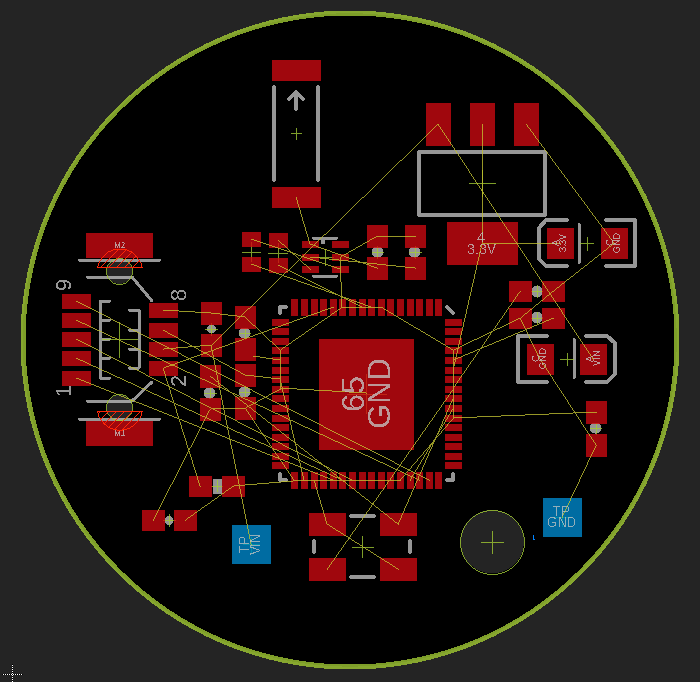

# 0x40 - PCB Design

**WARNING:** These problems are at the `H@k3rm@n` level. They are not required.

## Solution:

- [Solution](solution/solution.md)

## Resources:

- [Setting up EAGLE](https://learn.sparkfun.com/tutorials/how-to-install-and-setup-eagle)
- [Using EAGLE Schematic View](https://learn.sparkfun.com/tutorials/using-eagle-schematic)
- [Using EAGLE Board View](https://learn.sparkfun.com/tutorials/using-eagle-board-layout)

## Objective:

Your co-worker needs to design a basic PCB, but is a n00b and does not know how. Your co-worker tried to design the PCB, but says "the design is not possible". As a `H@k3rm@n`, you know this is likely false. Prove your co-worker wrong and fix the design & layout.

## Setup:

Your co-worker is using EAGLE to design their PCB. Install this into your Ubuntu VM as follows:

**NOTE:** We are using EAGLE 9.6.2, but the latest EAGLE version can be found [here](https://www.autodesk.com/products/eagle/free-download) for different OS platforms

```bash
wget -P /tmp https://trial2.autodesk.com/NET17SWDLD/2017/EGLPRM/ESD/Autodesk_EAGLE_9.6.2_English_Linux_64bit.tar.gz
tar -xvf /tmp/Autodesk_EAGLE_9.6.2_English_Linux_64bit.tar.gz -C ~/Desktop/
```

Then run the `~/Desktop/eagle-9.6.2/eagle` binary. You will need an account with [AutoDesk](https://en.wikipedia.org/wiki/Autodesk) to use EAGLE CAD software for free. Register [here](https://accounts.autodesk.com/register)

  - **NOTE:** If you do not want to give out your email, consider a [temporary email service](https://temp-mail.org/en/)

At this point, your environment should be setup. If you are new to EAGLE, see the _Resources_ section for great tutorials from SparkFun on how to use EAGLE for the first time.

## Problem:

Download the following EAGLE design files from your coworker and open them in EAGLE:

- [Board View](resources/design.brd)
- [Schematic View](resources/design.sch)

The design is a kinetic energy harvesting switch to power the [Atmega128rfa1](https://cdn.sparkfun.com/datasheets/Dev/AVR/ATmega128RFA1_Datasheeta.pdf) microprocessor to transmit AES encrypted data over IEEE 802.15.4. Your co-worker wants to use them as stealthy portable beacons. Your co-worker has already completed the circuit design in the schematic with all the needed parts, but cannot get the board layout correct to handle the RF design requirements.

**Your job is to finish the board layout for the RF design**. The overall PCB dimensions cannot be changed in order to meet the operations requirements from your co-worker's boss (_which is also your boss!_). Here is what the board design should look like when you first open it in EAGLE:



## Hints:

- The schematic you downloaded has very helpful notes in it to understand the components in the design!

- First organize the RF components (reference the schematic) and route those first! Then plan & route the rest. Remember the lecture notes on PC design and RF!

- SparkFun has a nice [board breakout](https://www.sparkfun.com/products/retired/11197) for the Atmega128rfa1 with **EAGLE reference design files** that may help with your design ...

- If kinetic energy harvesting is new topic to you, checkout the following resources for more info (_you do not need to know how kinetic energy harvesting works to complete this lab!_):

  - https://www.ti.com/lit/pdf/tiduc93
  - https://www.youtube.com/watch?v=9Pw7U0XFgUM
  - https://www.digikey.com/en/articles/build-a-battery-free-bluetooth-enabled-wireless-switch-for-smart-products
  - https://www.digikey.com/en/videos/o/on-semiconductor/coin-cell-temp-sensing--0-power-use-energy-harvesting
