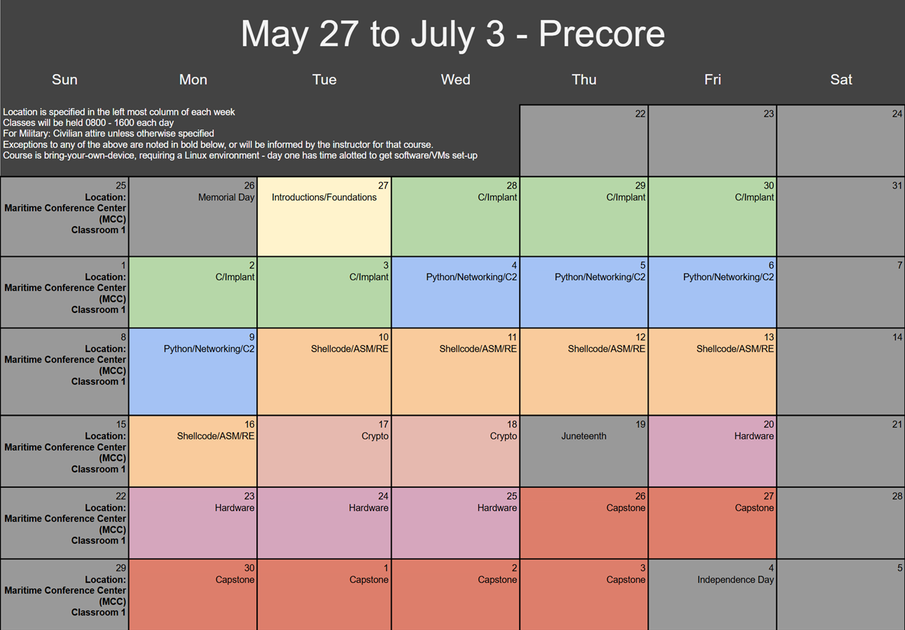

# Pre-CORE 2025

Welcome! Pre-CORE is an Air Force hosted training program to get members up to speed on development topics before entering the CORE training pipeline. This is to ensure that individuals coming from staff/administrative/leadership jobs have the opportunity to brush up prior to the CORE training firehose.

## Schedule

The calendar is [viewable online here](https://docs.google.com/spreadsheets/d/18q04ph0zQdPjvAenrT8Udl4wduihoQtP5SdtEu-uExw/edit?usp=sharing) and is provided here below:

## Location

Pre-CORE 2025 will be held in the following locations over the following dates:

**Maritime Conference Center** 
692 Maritime Blvd 
Linthicum Heights, MD 21090 

- May 27 to July 3: Classroom 1

Click [here](resources/mcc_property.pdf) for directions and a building layout.

## Requirements

- Students are required to bring a personal laptop for training.
  - Student environments should be x86/x86_64 (or emulate it appropriately).
  - **ARM processors, such as the M1, are not fully supported by the course content at this time. Cross-compilation is used to produce x86/x64 binaries**.
  - Student laptops should support WiFi and handle a 2 vCPU/4GB RAM virtual machine.

## Pre-Made Virtual Machine

The following virtual machine isn't required but we have put in tools you will need into one image. Download it before Day 1 of Pre-CORE and we can help you set it up.

- username: student
- password: precore

- [x86_64 Intel Processor Image (WIP)](https://drive.google.com/file/d/1MsmbaFYyNup1oGJvcaY-5MyzUSOQr0M-/view?usp=sharing) - This image will work for both VMWare and VirtualBox. However, VMWare is more performant.

## Custom Setup

- If you are comfortable setting up a C/Python/Assembly workflow of your own, you are able to use your own environment.

  - [Recommended Installed Items](resources/RecommendedEnvironment.md)

## Course Materials

- Please clone this repository to your environment prior to Pre-CORE
- The course slides are [available here](https://drive.google.com/drive/folders/1UE_-xn_uqygakUEzAAoSwDveC04yUQbJ?usp=sharing)

## Dress Policy

- For military members: Civilian Clothes unless otherwise specified on the calendar. All members are encouraged to dress as though this were external/vendor training.

## Discord

[Join the Pre-CORE Discord](https://discord.gg/c3hpKt38jZ) to receive announcements and class materials throughout the course.
