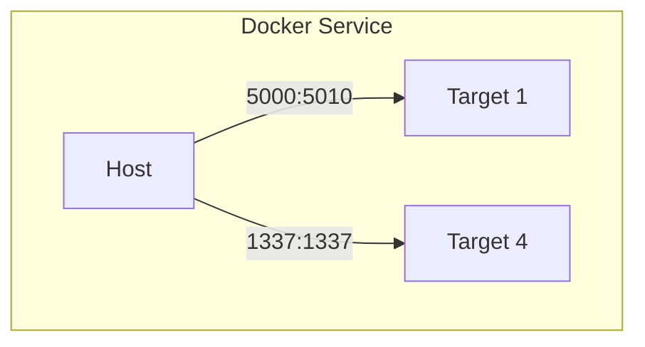
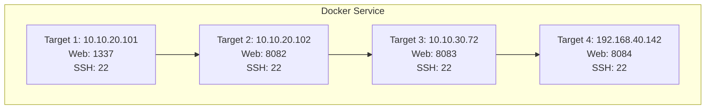

# Captsone: SSH Refresher

This refresher should help you navigate the capstone network and understand lateral movement.  The IP addresses and ports used in this example are unique and do not reflect what is in the capstone.

To start the docker containers, navigate to the directory holding the docker-compose.yml file and run:

```bash
sudo apt install docker.io docker-compose
sudo usermod -aG docker $USER
newgrp docker

# if newgrp doesn't work you can use the following, but it only works in the current terminal session
# to gain full membership to the docker group you'll need to restart your vm.
sudo su -l $USER

docker-compose up -d

# if you'd like to watch the progress of the build watch the the logs of one of the containers:
docker logs -t target1
```

## Network Layout

### Node Ports Exposed


### Network Map



## The Goal

Redirect port 1337 on Target 4 to port 1337 on Target 1 and use the host browser to view the web page.

## Commands

In order to better understand common SSH shorthand take a look at this SSH command breakdown for following SSH commands.

### General

SSH servers listen on port 22 by default and the SSH client will connect to port 22 unless otherwise defined.

#### Case 1:  
`ssh target1`
```bash
ssh     # Calls the binary for the SSH client local binary.
        # without defining a user, SSH will attempt to connect as your logged in user.
target1 # target1 is the host you want to connect to that will be resolved by DNS/config files.
```

#### Case 2:  
`ssh root@target1`  or  `ssh root@10.10.20.101`
```bash
ssh
root    # User you define to log in on the remote server
@       # Syntax required by SSH when not using DNS or config files
target1
```

### Tunnels

As discussed in the lecture, tunneling uses an existing connection to move data in a different channel, but within the same connection.  The exception being the entrance/exit ports of the tunneled connection will be noticeable on the host of either end.  To help you remember where you are and where you're sending data look at this syntax breakdown

```bash
ssh -L 8080:target3:8080 root@target2
ssh -R 8080:127.0.0.1:8080 root@target2

# These both do different things but look very similar. Remember this:

ssh [-L|-R] ENTRANCE_SOCKET:EXIT_TARGET_SOCKET USER@SERVER
```

#### Case 1: Forward Tunnel 
`ssh -L 8083:target3:8083 root@target2` or ` ssh -L 8083:10.10.30.72:8083 root@10.10.20.102`

These commands open a connection to target2, authenticates to the sshd daemon, establishes a new channel for the forward tunnel by opening a local socket on localhost and port 8083, and then connects it to target2. When traffic enters this tunnel it will send travel to the remote socket at target3 on port 8083.  The actual port on target2 used for this channel communication is a random high source port.

```bash
ssh -L LOCAL_SOCKET:REMOTE_SOCKET USER@SERVER_TO_AUTH

ssh 
-L                        # Option for forward tunnel or local port entrance, remote exit.
8083:10.10.30.72:8083     # argument for local port entrance
 \__ 8083                # Defines local socket and is actually shorthand for 127.0.0.1:8083
  \_ 10.10.30.72:8083    # The host:port that the remote end is ultimately routing too.

root@10.10.20.102         # Target to authenticate to.
```

#### Case 2: Reverse Tunnel
`ssh -R 1337:127.0.0.1:1337 root@target2`

This command will open a connection to target2, authenticate, establish a new channel for the reverse tunnel by opening up a socket on target 2 which will  only be accessible from localhost on port 1337.  This tunnel will point to localhost of target1 on port 1337.  If you want to have the remote port open globally so it's available to both subnets of target2 you need to change the argument to: `0.0.0.0:1337:127.0.0.1:1337`

```bash
ssh -R REMOTE_SOCKET:LOCAL_SOCKET USER@SERVER_TO_AUTH

ssh
-R                        # Option for reverse tunnel or remote port entrance, local exit
1337:127.0.0.1:1337
 \__ 1337                 # Defines remote socket, shorthand for 127.0.0.1:1337
  \_ 127.0.0.1:1337       # Local Socket where tunnel is pointing

root@target2              # Target to authenticate to.

```

### Helpful Options

Here are a list of some helpful options:

```bash
-i identity_file   # use certificates to auth to a server
-p sshd_port       # sshd service port if not 22
-v                 # verbose can be -vvv
-D port            # Dynamic port/socks5
```
And a list of options used for multiplexing commands over a local socket file:

```bash
-M                 # Set connection to use a master socket
-S Socket_location # File path to socket file    
-O command         # used to send commands to ssh server to control connection  

ssh -MS ~/.ssh/t2.sock -vp 22 root@target2
ssh -MS ~/.ssh/t2.sock -Nfv -p 22 root@target2  # background connection
ssh -O forward -R 9999:127.0.0.1:9999 @target2


## SCP using master socket
scp local_file root@target2:remote_file_path
    vs
scp -o ControlPath=~/.ssh/t2.sock local_file @:remote_file_path
```

Last to tie it all together to make ssh easy mode:
```bash
# ~/.ssh/config
Host t2
    HostName        10.10.20.102
    User            root
    port            22
    IdentityFile    ~/.ssh/id_rsa
    ControlMaster   auto
    ControlPath      ~/.ssh/t2.sock
    ControlPersist  4h

```
